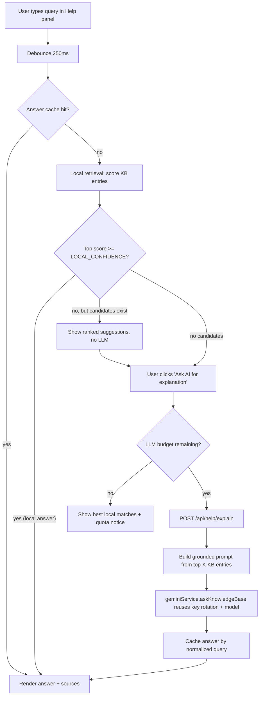
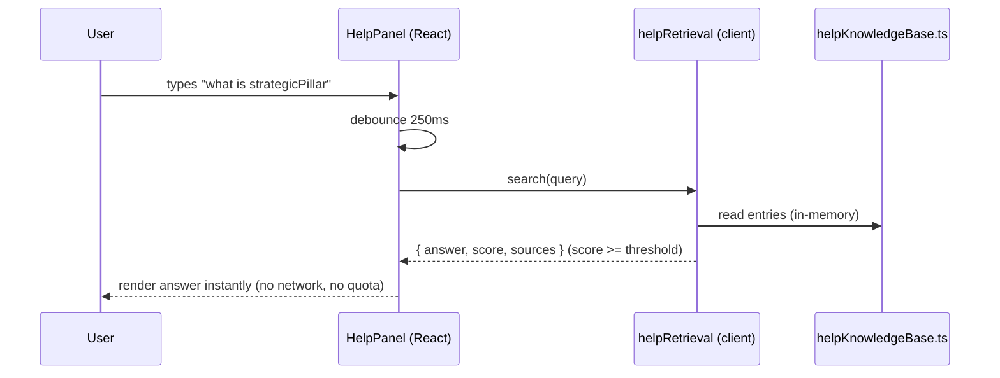
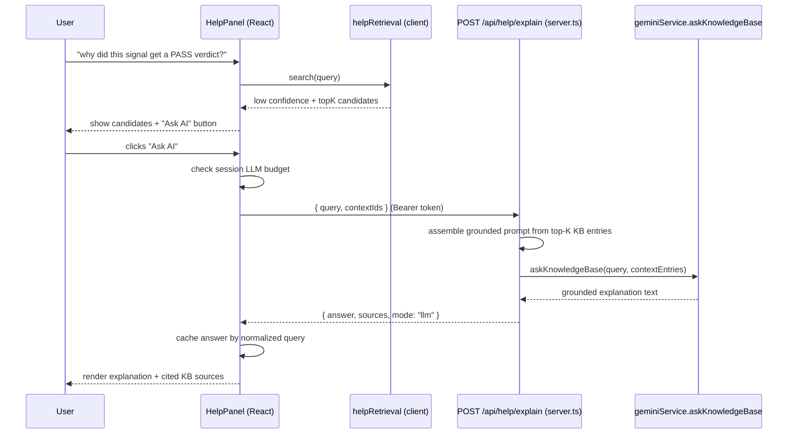

# Design Document: In-App Help / Search (Hybrid Knowledge Base)

## Overview

This feature adds an in-app knowledge base where Kaiso operators can ask what a section, metric, or
logic rule means (e.g. *"What does `strategicPillar` mean?"* or *"Why did this signal get a PASS verdict?"*)
and get an instant, accurate explanation. The core architectural decision is a **local-first hybrid**:
a deterministic, in-memory retrieval layer answers the overwhelming majority of queries with **zero LLM
calls**, and a Gemini synthesis fallback is invoked **only** for genuinely conceptual questions that the
local index cannot satisfy with confidence.

The design honors the project's hard constraints: it **reuses `geminiService.ts` unchanged** (no SDK or
model-setting edits), **adds no new npm dependencies** (no vector DB, no embeddings library), and **adds
no new fields to existing `src/types.ts` interfaces** — all new types live in a new module and are proposed
here for review. The knowledge base is authored as a static TypeScript data file derived from the existing
`AI_CONTEXT/` docs, making it "app-aware" without any runtime model cost.

### Architectural Critique & Recommendation (the "why")

A naive approach would forward every help query to Gemini. On the free tier this is the wrong design: it
burns quota on questions that have a fixed, known answer ("what is `opportunityScore`?"), adds 1–3s of
latency to trivial lookups, and makes the help system fail whenever quota is exhausted. The opposite
extreme — a pure keyword search over the docs — cannot answer compositional/conceptual questions
("why would a high-score signal still get PASS?").

**Recommendation: a three-tier router.** (1) A curated static knowledge base (KB) of ~40–80 entries keyed
to the real symbols in the codebase (`strategicPillar`, `opportunityScore`, `PASS`, `whiteSpaceStatus`,
each pipeline stage). (2) A deterministic local scorer (normalized token overlap + alias/synonym matching)
that returns a direct answer when its confidence clears a threshold. (3) A Gemini fallback that runs only
on a confident-miss, is grounded with the top-K retrieved KB entries as context (so it stays accurate and
on-domain), and is debounced + cached so repeated/again-asked questions never re-spend quota. This
keeps ~90%+ of traffic at zero cost while preserving the ability to answer the hard 10%.

---

## Architecture



Key properties of this topology:

- **The LLM is never on the default path.** It is reachable only via an explicit user action ("Ask AI")
  *or* when local retrieval has no usable candidates — and even then it is gated by a per-session budget.
- **Grounding, not free generation.** When Gemini is called, the top-K KB entries are passed as context so
  answers stay accurate and app-specific, and the model is instructed to answer only from that context.
- **Client/server split mirrors the existing app.** Local retrieval runs in the browser (instant, free).
  The LLM fallback goes through a new authenticated Express route, exactly like `/api/intelligence/*`.

### Where the knowledge base data lives

`src/data/helpKnowledgeBase.ts` — a static, typed, version-controlled array of KB entries. Rationale:

- It is bundled with the client, so local retrieval is instant and offline-capable (no fetch, no DB).
- It is plain TypeScript, so it is type-checked at build time and reviewable in PRs.
- It sits beside the existing `src/data/outcomes.json`, matching the current data convention.
- It is the single source of truth shared by both the client retrieval layer and the server grounding step.

No vector database and no embeddings model are introduced. For a KB of this size (tens of entries),
lexical scoring is more than sufficient and avoids both a heavy dependency and per-query embedding cost.

---

## Sequence Diagrams

### Local hit (the common case — zero LLM cost)



### LLM fallback (rare — conceptual question, explicit opt-in)



---

## Components and Interfaces

### Component 1: `helpKnowledgeBase.ts` (data)

**Purpose**: Static, app-aware knowledge base. Each entry explains one concept and is keyed to real
codebase symbols so retrieval can match user phrasing to the right entry.

**Responsibilities**:
- Hold curated explanations for metrics, sections, verticals/pillars, verdicts, and pipeline stages.
- Provide aliases/keywords per entry so colloquial phrasing matches (e.g. "PASS" ↔ "rejected", "skip").
- Be the grounding context source for the LLM fallback.

### Component 2: `helpRetrieval.ts` (client service, pure)

**Purpose**: Deterministic local search/router. No React, no I/O — pure functions for easy testing.

**Interface**:
```typescript
interface HelpSearchResult {
  mode: 'local' | 'suggestions' | 'needs-llm';
  answer: string | null;          // populated when mode === 'local'
  topMatches: ScoredEntry[];      // ranked candidates (for suggestions / grounding)
  confidence: number;             // 0..1 score of the best match
}

function searchKnowledgeBase(query: string, kb: HelpEntry[]): HelpSearchResult;
function scoreEntry(query: string, entry: HelpEntry): number; // 0..1
function normalize(text: string): string[];                   // lowercase, strip, tokenize
```

**Responsibilities**:
- Tokenize/normalize query and entries; score by weighted token overlap + alias/symbol exact-match boost.
- Decide routing mode from confidence thresholds (see Algorithmic Pseudocode).

### Component 3a: `helpBudget.ts` (pure budget + cache reducer)

**Purpose**: Pure state machine for the per-session LLM budget, the answer cache, and answer
resolution. Extracted out of `useHelpSearch.ts` so its invariants can be reasoned about and
property-tested with fast-check **without a DOM or React**. No React, no DOM, no I/O, no
module-level mutable state — `budgetReducer` returns a fresh state per `(state, action)` pair and
never mutates its inputs (the cache `Map` is copied on write).

**State shape**:
```typescript
interface BudgetState {
  llmBudgetRemaining: number;                 // remaining fallback calls; invariant: >= 0
  cache: ReadonlyMap<string, HelpAnswer>;     // keyed by normalized query (see cacheKey)
  answer: HelpAnswer | null;                  // currently resolved answer (cached local or LLM)
  isAsking: boolean;                          // true while a fallback call is in flight
  askFailed: boolean;                         // true when the most recent fallback failed (e.g. 502)
  llmCallsDispatched: number;                 // monotonic count of fallback dispatches this session
}
```

**Actions**:
```typescript
type BudgetAction =
  | { type: 'query-changed'; query: string }                 // typing: surface cached answer only
  | { type: 'ask'; query: string }                           // explicit "Ask AI" opt-in
  | { type: 'resolve'; query: string; answer: HelpAnswer }   // record resolved answer in cache
  | { type: 'ask-failed' }                                   // in-flight fallback failed
  | { type: 'new-session' };                                 // reset budget, cache, counters
```

- `query-changed`: the user typed; surface a cached answer for the query if present, otherwise clear
  the active answer. Clears `askFailed`. Never decrements budget, never dispatches an LLM call.
- `ask`: explicit opt-in. Resolves from cache for free if present; otherwise dispatches a fallback —
  decrementing `llmBudgetRemaining` and incrementing `llmCallsDispatched` — only while budget remains;
  blocks (no-op) at zero budget and while already asking.
- `resolve`: record a resolved answer (local or LLM) in the cache and surface it; idempotent per
  normalized query (the first cached answer for a key wins). Clears `isAsking` and `askFailed`.
- `ask-failed`: an in-flight fallback failed; clear `isAsking` and set `askFailed`. Budget is not refunded.
- `new-session`: reset budget to full, and clear cache, answer, and counters for a fresh session.

**Exports**:
```typescript
function budgetReducer(state: BudgetState, action: BudgetAction): BudgetState;
function createInitialBudgetState(budget?: number): BudgetState; // defaults to LLM_SESSION_BUDGET
function cacheKey(query: string): string;                        // normalized tokens joined to a key
```

**Invariants it makes provable** (and the Correctness Properties they back):
- A `query-changed` (typing) action never dispatches a fallback nor decrements the budget → backs
  **Property 1 (No-LLM-on-typing)**.
- Re-resolving an already-cached normalized query yields the identical stored `HelpAnswer` and
  dispatches no call → backs **Property 7 (Cache idempotence)**.
- `llmBudgetRemaining` never drops below 0 and `llmCallsDispatched <= LLM_SESSION_BUDGET` per
  session → backs **Property 8 (Budget safety)**.

### Component 3: `useHelpSearch.ts` (client hook)

**Purpose**: A **thin wrapper** over `budgetReducer` (via `useReducer`) holding only React glue:
debounce, the fetch to `/api/help/explain`, and wiring. It dispatches actions and owns **no**
budget/cache invariants — all budget, cache, and answer-resolution state lives in the pure
`helpBudget.ts` reducer (Component 3a).

**Interface**:
```typescript
interface UseHelpSearch {
  query: string;
  setQuery: (q: string) => void;
  result: HelpSearchResult | null;
  isAsking: boolean;             // true while LLM fallback in flight
  askFailed: boolean;            // true when the most recent fallback failed (e.g. 502)
  askAi: () => Promise<void>;    // explicit opt-in to LLM fallback
  llmBudgetRemaining: number;
}
```

**Responsibilities**:
- Debounce input (250ms) and run local retrieval on every settled keystroke (free), dispatching
  `query-changed` (and `resolve` on a confident local hit) to the reducer.
- On explicit `askAi()`, dispatch `ask` and — only when that transitions into the in-flight phase
  (cache miss + budget remaining) — POST to `/api/help/explain`, then dispatch `resolve` on success
  or `ask-failed` on error.
- Hold no budget or cache logic itself; surface the reducer's state (`answer`, `isAsking`,
  `askFailed`, `llmBudgetRemaining`) to the panel.

### Component 4: `HelpPanel.tsx` (client UI)

**Purpose**: The Help/Search modal. Reuses the existing `DocumentationView` modal styling/conventions.

**Responsibilities**:
- Render search box, instant local answer, ranked suggestions, "Ask AI" opt-in, and cited sources.
- Accessible: focusable controls, Esc closes, visible focus, `aria-live` for async answers.
- Derive the "AI explanation unavailable" notice from the hook's `askFailed` state (not a thrown
  error), keeping the closest local matches visible alongside it. The hook never rejects on a
  fallback failure (e.g. a 502); it surfaces the failure through state.

### Component 5: `POST /api/help/explain` (server route in `server.ts`)

**Purpose**: Authenticated LLM-fallback endpoint. Builds a grounded prompt and calls the existing
Gemini service. Subject to the existing auth middleware and `aiLimiter` rate limit.

**Responsibilities**:
- Validate input, resolve `contextIds` to KB entries server-side, assemble grounded prompt.
- Delegate to `geminiService.askKnowledgeBase` (reuses key rotation, model, retry — unchanged settings).

### Component 6: `geminiService.askKnowledgeBase` (additive export)

**Purpose**: A new exported function in the existing `geminiService.ts` that **reuses** `keyManager`,
`withTimeout`, and the existing model constant. It does **not** modify any existing function or setting.

**Interface**:
```typescript
// Added to geminiService.ts — reuses existing keyManager + model, no settings changed.
export async function askKnowledgeBase(
  query: string,
  context: HelpEntry[]
): Promise<string>;
```

---

## Data Models

> These are **new** types in a new file `src/services/helpTypes.ts`. They do **not** modify `src/types.ts`.
> They are proposed here for review per project rule "never modify types without showing the change first."

### Model 1: `HelpEntry`

```typescript
interface HelpEntry {
  id: string;                 // stable slug, e.g. "metric-opportunity-score"
  category: HelpCategory;     // grouping for UI + filtering
  title: string;              // human label, e.g. "opportunityScore"
  symbols: string[];          // exact code symbols this explains, e.g. ["opportunityScore"]
  aliases: string[];          // colloquial phrasings, e.g. ["the ranking number", "score"]
  body: string;               // the canonical explanation (markdown-light, <= ~600 chars)
  sourceDoc?: string;         // provenance, e.g. "AI_CONTEXT/PIPELINE_MAP.md"
}

type HelpCategory =
  | 'metric'
  | 'section'
  | 'verdict'
  | 'pillar'
  | 'vertical'
  | 'pipeline-stage'
  | 'concept';
```

**Validation Rules**:
- `id` is unique and non-empty across the KB.
- `title` and `body` are non-empty; `body` length kept small to bound bundle size and LLM context cost.
- `symbols` + `aliases` together must be non-empty (otherwise the entry is unreachable by search).

### Model 2: `ScoredEntry`

```typescript
interface ScoredEntry {
  entry: HelpEntry;
  score: number;              // 0..1 normalized match score
}
```

### Model 3: `HelpAnswer` (cached + rendered)

```typescript
interface HelpAnswer {
  query: string;              // original query
  answer: string;             // resolved explanation text
  sources: HelpSource[];      // KB entries that backed the answer
  mode: 'local' | 'llm';      // provenance of the answer (for UI badge + telemetry)
  answeredAt: number;         // epoch ms (cache freshness / debugging)
}

interface HelpSource {
  id: string;
  title: string;
  sourceDoc?: string;
}
```

### Model 4: `HelpExplainRequest` / `HelpExplainResponse` (API contract)

```typescript
interface HelpExplainRequest {
  query: string;
  contextIds: string[];       // KB entry ids selected by client retrieval as grounding
}

interface HelpExplainResponse {
  answer: string;
  sources: HelpSource[];
  mode: 'llm';
}
```

---

## Logic & Cost: The Hybrid Router

The router conserves quota through four layered mechanisms, in order of how often they save a call:

1. **Local-first answering** — if the best KB match clears `LOCAL_CONFIDENCE`, answer locally. No call.
2. **Suggestions before synthesis** — on a near-miss, show ranked candidate entries the user can click
   (which resolve to local answers). Synthesis is only reached if the user explicitly asks. No call.
3. **Answer caching** — every resolved answer (local or LLM) is cached by normalized query for the
   session. Re-asking, retyping, or two users hitting the same question costs nothing the second time.
4. **Session budget + debounce** — typing never triggers a call (debounced local search only); the LLM
   is reachable only via the explicit "Ask AI" button, and only while a small per-session budget remains.

Thresholds (tunable constants, no magic numbers in code):
- `DEBOUNCE_MS = 250`
- `LOCAL_CONFIDENCE = 0.55` (best-match score at/above this → answer locally)
- `SUGGEST_FLOOR = 0.20` (matches in `[SUGGEST_FLOOR, LOCAL_CONFIDENCE)` → show as suggestions)
- `TOP_K = 4` (candidates surfaced and used as LLM grounding context)
- `LLM_SESSION_BUDGET = 15` (max fallback calls per browser session before graceful degrade)

---

## Algorithmic Pseudocode

### Local retrieval + routing

```pascal
ALGORITHM searchKnowledgeBase(query, kb)
INPUT: query (string), kb (array of HelpEntry)
OUTPUT: HelpSearchResult

BEGIN
  ASSERT query is not null

  qTokens ← normalize(query)            // lowercase, strip punctuation, split, drop stopwords
  IF qTokens is empty THEN
    RETURN { mode: 'suggestions', answer: NULL, topMatches: [], confidence: 0 }
  END IF

  scored ← empty list
  FOR each entry IN kb DO
    s ← scoreEntry(query, entry)        // 0..1
    IF s > 0 THEN scored.add({ entry, score: s })
  END FOR

  sortDescendingByScore(scored)
  topMatches ← scored.take(TOP_K)
  best ← topMatches.first  (or NULL)

  IF best = NULL THEN
    RETURN { mode: 'needs-llm', answer: NULL, topMatches: [], confidence: 0 }
  END IF

  IF best.score >= LOCAL_CONFIDENCE THEN
    RETURN { mode: 'local', answer: best.entry.body, topMatches, confidence: best.score }
  ELSE IF best.score >= SUGGEST_FLOOR THEN
    RETURN { mode: 'suggestions', answer: NULL, topMatches, confidence: best.score }
  ELSE
    RETURN { mode: 'needs-llm', answer: NULL, topMatches, confidence: best.score }
  END IF
END
```

**Preconditions:** `query` is a string (possibly empty); `kb` is a valid, non-empty array.
**Postconditions:** Returns exactly one mode; `mode = 'local'` implies `answer` is non-null and
`confidence >= LOCAL_CONFIDENCE`; `topMatches.length <= TOP_K`; pure (no mutation of `kb`, no I/O).
**Loop invariant:** after processing the first *i* entries, `scored` contains exactly those of the first
*i* entries whose score `> 0`.

### Entry scoring

```pascal
ALGORITHM scoreEntry(query, entry)
INPUT: query (string), entry (HelpEntry)
OUTPUT: score in [0, 1]

BEGIN
  qTokens ← normalize(query)
  qLower  ← toLowerCase(query)

  // Strong signal: exact symbol or alias appears in the query
  FOR each sym IN entry.symbols DO
    IF qLower contains toLowerCase(sym) THEN RETURN 1.0
  END FOR
  FOR each a IN entry.aliases DO
    IF qLower contains toLowerCase(a) THEN RETURN max(currentBest, 0.85)
  END FOR

  // Otherwise: weighted token overlap against title + aliases + body
  entryTokens ← normalize(entry.title + ' ' + join(entry.aliases) + ' ' + entry.body)
  overlap ← countCommon(qTokens, entryTokens)
  IF qTokens is empty THEN RETURN 0
  coverage ← overlap / size(qTokens)        // how much of the query is explained by this entry

  RETURN clamp(coverage, 0, 1)
END
```

**Preconditions:** `entry` is well-formed (`symbols`+`aliases` non-empty per validation).
**Postconditions:** returns a value in `[0,1]`; an exact symbol match returns `1.0`; no side effects.

### LLM fallback grounding (server)

```pascal
ALGORITHM explainWithGemini(query, contextIds)
INPUT: query (string), contextIds (array of string)
OUTPUT: HelpExplainResponse

BEGIN
  ASSERT query is non-empty
  context ← resolveEntriesById(contextIds, kb)   // server-side lookup, ignores unknown ids
  prompt  ← buildGroundedPrompt(query, context)  // instruct: answer ONLY from provided context

  // Reuses existing geminiService.keyManager + model + retry; settings unchanged.
  answer  ← geminiService.askKnowledgeBase(query, context)

  RETURN {
    answer,
    sources: context.map(e -> { id: e.id, title: e.title, sourceDoc: e.sourceDoc }),
    mode: 'llm'
  }
END
```

**Preconditions:** request passed auth + `aiLimiter`; `query` non-empty.
**Postconditions:** answer is grounded in the resolved `context` entries; `sources` reflects only entries
that actually existed; on Gemini failure the route returns a 502 and the client degrades to local matches.

---

## Example Usage

```typescript
// CLIENT — instant local answer, no network, no quota
const result = searchKnowledgeBase("what does strategicPillar mean", KNOWLEDGE_BASE);
if (result.mode === 'local') {
  render(result.answer);              // resolved from helpKnowledgeBase.ts
}

// CLIENT — conceptual question: local misses, user opts in to AI
const r2 = searchKnowledgeBase("why did this signal get a PASS verdict", KNOWLEDGE_BASE);
if (r2.mode !== 'local') {
  showSuggestions(r2.topMatches);     // still free
  // only on explicit user click:
  const answer = await askAi();       // POST /api/help/explain with r2.topMatches ids as context
}

// SERVER (server.ts) — fallback route, reuses existing Gemini client
app.post("/api/help/explain", async (req, res) => {
  const { query, contextIds } = req.body as HelpExplainRequest;
  if (!query?.trim()) return res.status(400).json({ error: "query required" });
  try {
    const context = resolveEntriesById(contextIds);
    const answer = await askKnowledgeBase(query, context);     // existing keyManager + model
    res.json({ answer, sources: context.map(toSource), mode: "llm" });
  } catch (err) {
    res.status(502).json({ error: "AI explanation unavailable. Showing local matches." });
  }
});
```

---

## Correctness Properties

These are universally-quantified statements the implementation must satisfy; they drive the
property-based tests in the testing strategy.

### Property 1: No-LLM-on-typing
For all keystroke sequences, local retrieval alone runs; an LLM request is emitted only after an explicit
`askAi()` invocation. (∀ inputs, llmCalls == 0 unless askAi called.)
**Validates: Requirements 4.2**

### Property 2: Local-confidence soundness
For all queries, `mode === 'local' ⟹ answer !== null ∧ confidence ≥ LOCAL_CONFIDENCE`.
**Validates: Requirements 1.2**

### Property 3: Exact-symbol determinism
For all entries `e` and queries containing a symbol of `e`, `scoreEntry(query, e) === 1.0` (exact-symbol
queries are always answered locally).
**Validates: Requirements 3.1**

### Property 4: Score bounds
For all queries and entries, `0 ≤ scoreEntry(query, entry) ≤ 1`.
**Validates: Requirements 3.4**

### Property 5: Purity
For all inputs, `searchKnowledgeBase` does not mutate the KB and returns equal results for equal inputs
(referential transparency).
**Validates: Requirements 3.5**

### Property 6: TopK bound
For all queries, `result.topMatches.length ≤ TOP_K`.
**Validates: Requirements 1.5**

### Property 7: Cache idempotence
For all queries `q`, asking `q` twice yields identical answers and the second resolution performs no
network/LLM call.
**Validates: Requirements 5.3**

### Property 8: Budget safety
For all sessions, total LLM fallback calls `≤ LLM_SESSION_BUDGET`; beyond it the panel degrades to local
matches without error.
**Validates: Requirements 7.2**

### Property 9: Grounding integrity
For all fallback responses, every entry in `sources` corresponds to a real KB entry resolved from
`contextIds` (no fabricated sources).
**Validates: Requirements 8.3**

---

## Error Handling

### Scenario 1: Gemini unavailable / all keys quota-exhausted
**Condition**: `askKnowledgeBase` throws (quota, timeout, transient).
**Response**: Route returns 502; the hook dispatches `ask-failed` and surfaces the failure through its
`askFailed` state rather than throwing. The panel derives a quiet "AI explanation unavailable right now
— here are the closest matches" notice from `askFailed` and keeps the best local `topMatches` visible.
**Recovery**: User can retry later; local search remains fully functional (no hard dependency on AI).

### Scenario 2: Empty or whitespace query
**Condition**: Query normalizes to zero tokens.
**Response**: Return `mode: 'suggestions'` with empty matches; UI shows category browse list. No call.

### Scenario 3: LLM budget exhausted
**Condition**: `llmBudgetRemaining === 0`.
**Response**: "Ask AI" is disabled with a tooltip; only local results show.
**Recovery**: Budget resets on new session (page reload).

### Scenario 4: Unknown / stale `contextIds` at server
**Condition**: Client sends ids not present in the KB (version skew).
**Response**: Server ignores unknown ids and grounds on the resolvable subset; if none resolve, it returns
a 400 so the client falls back to local suggestions.

---

## Testing Strategy

### Unit Testing Approach
- `normalize`: punctuation stripping, casing, stopword removal, empty input.
- `scoreEntry`: exact symbol → 1.0; alias → ≥0.85; partial overlap in `[0,1]`; no-match → 0.
- `searchKnowledgeBase`: mode boundaries at `LOCAL_CONFIDENCE` and `SUGGEST_FLOOR`; `TOP_K` truncation.
- Server route: 400 on empty query, 502 on Gemini failure, happy-path shape.

### Property-Based Testing Approach
Use **fast-check** (already a devDependency — no new package). Encode the Correctness Properties:
- Generate arbitrary query strings + KB arrays → assert score bounds (Prop 4), purity (Prop 5),
  TopK bound (Prop 6), and local-confidence soundness (Prop 2).
- Generate queries seeded with a known entry symbol → assert score `=== 1.0` (Prop 3).
- Generate keystroke sequences → assert zero LLM calls without `askAi` (Prop 1), and cache idempotence
  (Prop 7) via a mocked transport spy.

**Property Test Library**: fast-check (existing).

### Integration Testing Approach
- Client hook + mocked `/api/help/explain`: verify local-hit path makes no fetch; verify fallback path
  fires exactly once, caches the result, and decrements the budget.

---

## Performance Considerations

- Local retrieval is O(N·T) over a small KB (N ≈ tens of entries, T = tokens); sub-millisecond in practice.
- Memoize normalized entry token lists at module load so each query only tokenizes the query.
- Debounce (250ms) prevents per-keystroke work bursts; results cached per normalized query.
- KB body lengths are bounded (~600 chars) to keep the client bundle small and LLM context cheap.
- No layout shift: panel reserves answer area height; `aria-live` region updates in place (CLS-safe).

## Security Considerations

- `/api/help/explain` sits **below** the existing auth middleware → requires `Bearer` token like all
  `/api/*` routes, and is covered by `aiLimiter` (10/min) to prevent quota-draining abuse.
- Input is treated as untrusted: query length-capped server-side; `contextIds` validated against the KB
  (no arbitrary content reaches the model beyond curated KB entries).
- The grounded prompt instructs the model to answer only from supplied context, reducing the blast radius
  of prompt-injection in the user's question.
- No secrets or pipeline data are sent to the model — only the curated KB entries and the user's question.

## Dependencies

- **No new npm packages.** Reuses: `@google/genai` (via existing `geminiService.ts`), `express`,
  `express-rate-limit`, React 19, Tailwind, `motion`, `lucide-react`, and `fast-check` (tests).
- **Reuses unchanged**: `geminiService.keyManager`, `withTimeout`, existing model constant, auth
  middleware, and `aiLimiter` in `server.ts`.
- **New files**: `src/data/helpKnowledgeBase.ts`, `src/services/helpTypes.ts`,
  `src/services/helpRetrieval.ts`, `src/hooks/useHelpSearch.ts`, `src/components/HelpPanel.tsx`,
  and one additive export (`askKnowledgeBase`) in `src/services/geminiService.ts`.
- **Open item requiring approval**: none required. If future scale (hundreds of entries) warrants semantic
  search, an embeddings approach would be proposed separately as an **optional** dependency for approval —
  explicitly out of scope here.

## Integration With Current Codebase (summary)

| Concern | Decision |
|---|---|
| KB data location | `src/data/helpKnowledgeBase.ts` (beside existing `outcomes.json`), authored from `AI_CONTEXT/` |
| Local search | `src/services/helpRetrieval.ts` (pure, client-side, zero cost) |
| React glue | `src/hooks/useHelpSearch.ts` + `src/components/HelpPanel.tsx` (reuses `DocumentationView` styling) |
| LLM fallback | new `POST /api/help/explain` in `server.ts`, behind existing auth + `aiLimiter` |
| Gemini access | additive `askKnowledgeBase()` in `geminiService.ts` — reuses key rotation + model, **no setting changes** |
| Types | new `src/services/helpTypes.ts` — **no edits to `src/types.ts`** |
| Dependencies | **none added** |
