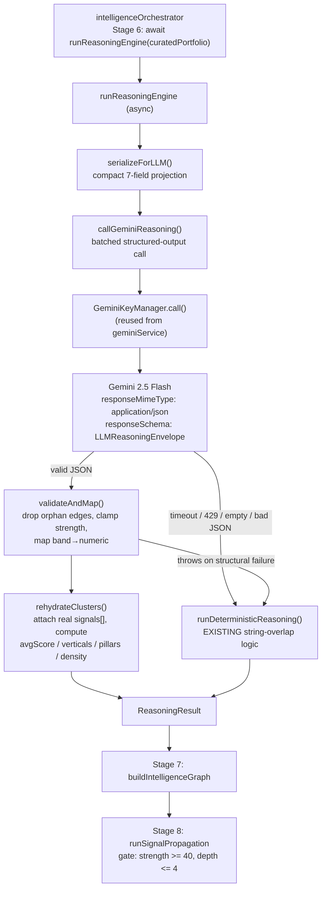
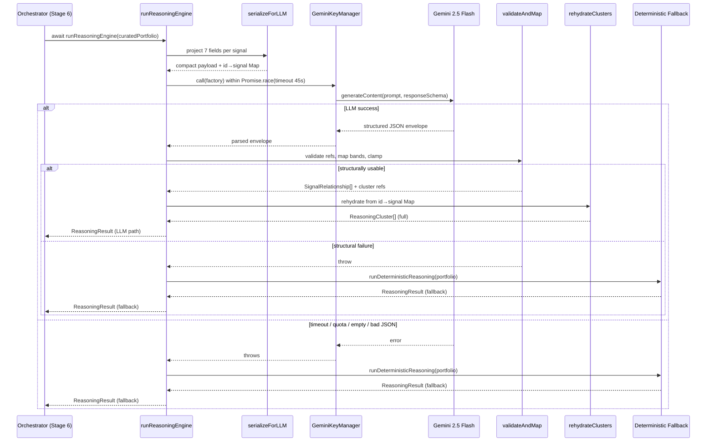

# Design Document: Reasoning Engine LLM Upgrade

## Overview

Stage 6 of the Kaiso intelligence pipeline (`reasoningEngine.ts`) currently derives signal relationships and thematic clusters from deterministic string-overlap math. This upgrade replaces that core inference with a single batched **Gemini Structured-Outputs** call (`gemini-2.5-flash` default) that reasons about convergence across the *entire* `curatedPortfolio` at once — surfacing causal links, supply-chain dependencies, regulatory spillover, and upstream/downstream commercial implications that string matching cannot see.

The upgrade is a **drop-in replacement** of `reasoningEngine.ts` plus a **one-line orchestrator change** (`await runReasoningEngine(...)`). It preserves the exact `ReasoningResult` contract consumed by `intelligenceGraphEngine.ts` (Stage 7) and `signalPropagationEngine.ts` (Stage 8). The LLM emits only **lightweight references** (cluster keys + edge tuples); deterministic TypeScript then **rehydrates** full `ReasoningCluster` objects from the in-memory `curatedPortfolio`, computing all derived numeric fields locally. On *any* LLM failure (timeout, quota, malformed JSON, referentially-invalid edges), the engine falls back to the existing deterministic implementation, guaranteeing a valid `ReasoningResult` every run.

This design honors project steering: no SDK change (`@google/genai`), no new npm packages, no `types.ts` mutation, surgical footprint, and reuse of the existing `GeminiKeyManager` rotation/retry plumbing from `geminiService.ts`.

---

## Architecture



The public surface stays identical except for async: `runReasoningEngine` becomes `async` and returns `Promise<ReasoningResult>`. The exported helpers `buildSignalRelationships` and `buildReasoningClusters` are retained (now the deterministic fallback core) so nothing else that imports them breaks.

---

## Sequence Diagram: Stage 6 Reasoning Flow



---

## Section 1 — Compatibility & Type Contract Integrity

### 1.1 Preserved Public Contract (UNCHANGED — defined in `reasoningEngine.ts`)

These interfaces are **not modified**. They are the contract Stage 7 and Stage 8 consume.

```typescript
export type RelationshipType =
  | "Thematic Convergence"
  | "Supply Chain Dependency"
  | "Regulatory Spillover"
  | "Technology Enablement"
  | "Buyer Overlap"
  | "Geographic Reinforcement"
  | "Capital Flow Alignment"
  | "Infrastructure Coupling";

export interface SignalRelationship {
  sourceId: string;          // MUST be a valid curatedPortfolio[].id
  targetId: string;          // MUST be a valid curatedPortfolio[].id
  relationshipType: RelationshipType;
  strength: number;          // 0–100 (Stage 8 gates on >= 40)
  rationale: string;
}

export interface ReasoningCluster {
  clusterId: string;                 // deterministic (see Section 2)
  thematicCluster: string;
  signals: ReportSuggestion[];       // REHYDRATED locally, never emitted by LLM
  averageOpportunityScore: number;   // COMPUTED locally
  dominantVerticals: string[];       // COMPUTED locally
  dominantPillars: string[];         // COMPUTED locally
  relationshipDensity: number;       // COMPUTED locally
  strategicNarrative: string;        // LLM-provided OR locally synthesized
}

export interface ReasoningResult {
  relationships: SignalRelationship[];
  clusters: ReasoningCluster[];
  strongestSignals: ReportSuggestion[];   // top-10 by opportunityScore, computed locally
  macroThemes: string[];                   // unique thematicClusters, computed locally
  reasoningSummary: string;
}
```

### 1.2 The Lightweight LLM Envelope (NEW — internal only, NOT exported to other engines)

The model is **never** asked to emit `ReportSuggestion[]`, `averageOpportunityScore`, `dominantVerticals`, `dominantPillars`, or `relationshipDensity`. Emitting full report objects would bloat tokens and invite hallucinated signal data. Instead the model returns only references and qualitative judgments:

```typescript
// Internal types — declared inside reasoningEngine.ts, not in types.ts
type ConfidenceBand = "WEAK" | "MODERATE" | "STRONG" | "CRITICAL";

interface LLMEdge {
  sourceId: string;              // must reference a real signal id
  targetId: string;              // must reference a real signal id
  relationshipType: RelationshipType;
  confidence: ConfidenceBand;    // mapped → numeric strength locally
  rationale: string;
}

interface LLMClusterRef {
  thematicCluster: string;       // human-readable theme label
  memberSignalIds: string[];     // ids drawn from curatedPortfolio
  strategicNarrative: string;
}

interface LLMReasoningEnvelope {
  edges: LLMEdge[];
  clusters: LLMClusterRef[];
  macroThemes: string[];
  reasoningSummary: string;
}
```

### 1.3 Gemini Structured-Outputs `responseSchema`

Mirrors the `Type.*` schema convention already used in `geminiService.ts` (`analyzeNews`). `relationshipType` and `confidence` are constrained by `enum` to eliminate free-text drift.

```typescript
import { Type } from "@google/genai";

const REASONING_SCHEMA = {
  type: Type.OBJECT,
  properties: {
    edges: {
      type: Type.ARRAY,
      items: {
        type: Type.OBJECT,
        properties: {
          sourceId:         { type: Type.STRING },
          targetId:         { type: Type.STRING },
          relationshipType: {
            type: Type.STRING,
            enum: [
              "Thematic Convergence", "Supply Chain Dependency",
              "Regulatory Spillover", "Technology Enablement",
              "Buyer Overlap", "Geographic Reinforcement",
              "Capital Flow Alignment", "Infrastructure Coupling",
            ],
          },
          confidence: {
            type: Type.STRING,
            enum: ["WEAK", "MODERATE", "STRONG", "CRITICAL"],
          },
          rationale:        { type: Type.STRING },
        },
        required: ["sourceId", "targetId", "relationshipType", "confidence", "rationale"],
      },
    },
    clusters: {
      type: Type.ARRAY,
      items: {
        type: Type.OBJECT,
        properties: {
          thematicCluster:   { type: Type.STRING },
          memberSignalIds:   { type: Type.ARRAY, items: { type: Type.STRING } },
          strategicNarrative:{ type: Type.STRING },
        },
        required: ["thematicCluster", "memberSignalIds", "strategicNarrative"],
      },
    },
    macroThemes:      { type: Type.ARRAY, items: { type: Type.STRING } },
    reasoningSummary: { type: Type.STRING },
  },
  required: ["edges", "clusters", "macroThemes", "reasoningSummary"],
} as const;
```

### 1.4 Confidence Band → Numeric `strength` Mapping

Qualitative bands map to the strict 0–100 scale. The mapping is calibrated so **MODERATE and above clear the Stage 8 `MIN_PROPAGATION_STRENGTH (40)` gate**, while WEAK edges are retained for the graph but stay below the propagation threshold (matching existing behavior where weak edges exist but do not cascade).

| Band | Numeric `strength` | Stage 8 (`>= 40`) | Rationale |
|------|--------------------|-------------------|-----------|
| `WEAK` | 30 | excluded from propagation | present in graph, no cascade |
| `MODERATE` | 55 | propagates | clears gate with margin |
| `STRONG` | 75 | propagates | strong cascade weight |
| `CRITICAL` | 95 | propagates | dominant cascade weight |

```typescript
const BAND_TO_STRENGTH: Record<ConfidenceBand, number> = {
  WEAK: 30, MODERATE: 55, STRONG: 75, CRITICAL: 95,
};

function bandToStrength(band: ConfidenceBand): number {
  const raw = BAND_TO_STRENGTH[band] ?? 30;   // unknown band → WEAK floor
  return Math.max(0, Math.min(100, raw));     // defensive clamp to 0–100
}
```

### 1.5 Edge Referential Validation (orphan-edge prevention)

Every LLM-emitted `sourceId`/`targetId` MUST resolve to a real `curatedPortfolio` id. The adjacency map in `signalPropagationEngine` would otherwise dangle on unknown nodes. Self-loops and duplicate undirected pairs are also dropped.

```typescript
function validateEdges(
  llmEdges: LLMEdge[],
  validIds: Set<string>
): SignalRelationship[] {
  const seen = new Set<string>();
  const out: SignalRelationship[] = [];

  for (const e of llmEdges) {
    if (!validIds.has(e.sourceId) || !validIds.has(e.targetId)) continue; // orphan → drop
    if (e.sourceId === e.targetId) continue;                              // self-loop → drop
    const pairKey = [e.sourceId, e.targetId].sort().join("::");           // undirected dedupe
    if (seen.has(pairKey)) continue;
    seen.add(pairKey);

    out.push({
      sourceId: e.sourceId,
      targetId: e.targetId,
      relationshipType: e.relationshipType,
      strength: bandToStrength(e.confidence),
      rationale: e.rationale,
    });
  }
  return out.sort((a, b) => b.strength - a.strength);
}
```

### 1.6 Cluster Rehydration (full contract reconstruction)

The LLM provides only `thematicCluster`, `memberSignalIds`, and `strategicNarrative`. Deterministic code rebuilds the exact `ReasoningCluster` shape Stage 7 reads — attaching real `ReportSuggestion[]` and computing every numeric field locally from the authoritative in-memory portfolio. Unknown member ids are silently dropped; empty clusters are discarded.

```typescript
function rehydrateClusters(
  llmClusters: LLMClusterRef[],
  relationships: SignalRelationship[],
  byId: Map<string, ReportSuggestion>
): ReasoningCluster[] {
  const clusters: ReasoningCluster[] = [];

  for (const ref of llmClusters) {
    const signals = ref.memberSignalIds
      .map(id => byId.get(id))
      .filter((s): s is ReportSuggestion => Boolean(s)); // drop unknown ids

    if (signals.length === 0) continue;

    const avgScore =
      signals.reduce((sum, s) => sum + (s.opportunityScore || 0), 0) / signals.length;

    const memberIds = new Set(signals.map(s => s.id));
    const internalRels = relationships.filter(
      r => memberIds.has(r.sourceId) && memberIds.has(r.targetId)
    );
    const density =
      signals.length <= 1
        ? 0
        : Math.round((internalRels.length / (signals.length * (signals.length - 1))) * 100);

    clusters.push({
      clusterId: deterministicClusterId(ref.thematicCluster), // Section 2
      thematicCluster: ref.thematicCluster,
      signals,                                                 // REAL objects
      averageOpportunityScore: Math.round(avgScore * 10) / 10,
      dominantVerticals: unique(signals.map(s => s.vertical)),
      dominantPillars: unique(signals.map(s => s.strategicPillar).filter(Boolean) as string[]),
      relationshipDensity: density,
      strategicNarrative: ref.strategicNarrative,
    });
  }

  return clusters.sort((a, b) => b.averageOpportunityScore - a.averageOpportunityScore);
}
```

This guarantees `buildClusterNodes` (reads `clusterId`, `thematicCluster`, `averageOpportunityScore`, `dominantVerticals`, `dominantPillars`, `relationshipDensity`, `signals.length`) and `buildClusterMembershipEdges` (iterates `cluster.signals`, uses `signal.id`) receive byte-compatible input.

---

## Section 2 — Deterministic Cluster ID Generation

### 2.1 Problem

Current code: `clusterId: \`cluster_${Math.random().toString(36).substring(2, 10)}\``. Non-deterministic ids make the pipeline non-reproducible and impossible to unit-test for stability — identical inputs yield different graphs every run.

### 2.2 Strategy: FNV-1a hash of normalized theme

Replace `Math.random()` with a stable, collision-resistant **FNV-1a 32-bit** hash over the normalized `thematicCluster` label, namespaced with a `cluster_` prefix and emitted as zero-padded hex. Identical theme strings produce **byte-identical** ids across runs and machines. No dependency — FNV-1a is a few lines.

```typescript
/** FNV-1a 32-bit hash → 8-char hex. Deterministic, no dependencies. */
function fnv1a(input: string): string {
  let hash = 0x811c9dc5;                  // FNV offset basis
  for (let i = 0; i < input.length; i++) {
    hash ^= input.charCodeAt(i);
    hash = Math.imul(hash, 0x01000193);   // FNV prime, 32-bit via imul
  }
  return (hash >>> 0).toString(16).padStart(8, "0"); // unsigned, 8 hex chars
}

/** Stable cluster id from a theme label. Same theme ⇒ same id, every run. */
function deterministicClusterId(thematicCluster: string): string {
  const normalized = String(thematicCluster || "uncategorized")
    .toLowerCase()
    .trim()
    .replace(/\s+/g, " ");
  return `cluster_${fnv1a(normalized)}`;
}
```

**Determinism guarantee:** `deterministicClusterId("AI Data Centers") === deterministicClusterId("ai data centers ")` → both `cluster_xxxxxxxx`, identical bytes. This makes Stage 7 cluster node ids and Stage 8 cluster-membership edge targets fully reproducible and unit-testable.

> **Scope note:** `signalPropagationEngine`'s `path_${Math.random()}` exhibits the same non-determinism conceptually, but fixing it is **out of scope** for this spec, which targets `reasoningEngine` output determinism only. Documented here for traceability.

---

## Section 3 — Prompt Strategy for Convergent Reasoning

### 3.1 Batched, whole-portfolio reasoning

One call analyzes the **entire** `curatedPortfolio` simultaneously (NOT per-pair), so the model can reason about cross-opportunity convergence holistically. Portfolio is ~8–10 signals post-diversity, so a single call is well within token budget.

### 3.2 Compact input serialization (token control)

Only 7 fields per signal are serialized — never the whole `ReportSuggestion`. This caps tokens and removes fields irrelevant to relationship inference.

```typescript
interface LLMSignalProjection {
  id: string;
  reportTitle: string;
  marketKeyword: string;
  vertical: string;
  strategicPillar: string;
  thematicCluster: string;
  primaryStakeholder: string;
}

function serializeForLLM(portfolio: ReportSuggestion[]): LLMSignalProjection[] {
  return portfolio.map(s => ({
    id: s.id,
    reportTitle: s.reportTitle,
    marketKeyword: s.marketKeyword,
    vertical: s.vertical,
    strategicPillar: s.strategicPillar ?? "Unspecified",
    thematicCluster: s.thematicCluster,
    primaryStakeholder: s.primaryStakeholder ?? "Unspecified",
  }));
}
```

### 3.3 Prompt architecture

The prompt explicitly directs the model to uncover causal relationships, supply-chain dependencies, regulatory spillover, and upstream/downstream commercial implications, and to map each to the correct `relationshipType` enum value. It instructs the model to use only the provided `id` values for edges and cluster membership.

```text
You are the strategic reasoning core of a B2B market-intelligence platform.
Below is the full curated portfolio of opportunities for this cycle. Analyze
the ENTIRE set together and reason about how these opportunities converge.

Identify relationships between signals. For each relationship, uncover:
  - Causal relationships (one signal drives or enables another)
  - Supply chain dependencies (upstream/downstream production linkage)
  - Regulatory spillover (a policy trigger affecting multiple signals)
  - Upstream/downstream commercial implications (buyer/capital/infrastructure flow)

Map every relationship to EXACTLY ONE relationshipType:
  "Thematic Convergence" | "Supply Chain Dependency" | "Regulatory Spillover" |
  "Technology Enablement" | "Buyer Overlap" | "Geographic Reinforcement" |
  "Capital Flow Alignment" | "Infrastructure Coupling"

Assign each relationship a confidence band: WEAK | MODERATE | STRONG | CRITICAL.

RULES:
  - Use ONLY the exact "id" values provided below for sourceId/targetId and
    cluster memberSignalIds. Never invent ids.
  - Group signals into thematic clusters by genuine strategic convergence.
  - Return STRICT JSON matching the provided schema. No markdown, no prose.

PORTFOLIO:
${JSON.stringify(serializeForLLM(portfolio), null, 2)}
```

### 3.4 Gemini config (reuse `geminiService.ts` conventions)

```typescript
const REASONING_MODEL_CHAIN = ["gemini-2.5-flash", "gemini-2.5-flash-lite"];

// per-call config (mirrors analyzeNews)
config: {
  temperature: 0.2,
  thinkingConfig: { thinkingBudget: 4096 },
  responseMimeType: "application/json",
  responseSchema: REASONING_SCHEMA,
}
```

The call is dispatched through the **existing** `keyManager.call(factory)` so multi-key rotation, quota failover, and transient-retry logic are reused unchanged. (If `keyManager`/`safeJsonParse` are not currently exported from `geminiService.ts`, a minimal `export` is added there — no logic change.)

---

## Section 4 — Error Handling & Timeout Resilience

### 4.1 Bounded per-call timeout

Stage 6 runs inside the synchronous `/api/intelligence/run` pipeline under the **600s Express timeout**. A bounded 45s `Promise.race` (with `AbortController` signal passed to the SDK where supported) prevents a hung LLM call from consuming the whole budget.

```typescript
const REASONING_TIMEOUT_MS = 45_000;

function withTimeout<T>(p: Promise<T>, ms: number, ctrl: AbortController): Promise<T> {
  return Promise.race([
    p,
    new Promise<T>((_, reject) =>
      setTimeout(() => { ctrl.abort(); reject(new Error("Reasoning LLM timeout")); }, ms)
    ),
  ]);
}
```

### 4.2 Failure taxonomy → handling

| Failure | Detection | Handling |
|---------|-----------|----------|
| API/network error | factory throws | caught → deterministic fallback |
| 429 / quota | `GeminiKeyManager` rotates keys; throws if all exhausted | caught → deterministic fallback |
| Timeout (hung call) | `Promise.race` + `AbortController` | caught → deterministic fallback |
| Empty response | `!raw` / empty text | caught → deterministic fallback |
| Malformed / invalid JSON | `safeJsonParse` returns `null` | caught → deterministic fallback |
| Schema-valid but referentially-invalid edges | `validateEdges` drops orphans | partial recovery; if zero usable edges AND zero usable clusters → fallback |

### 4.3 Type-safe fallback to existing deterministic math

On **any** failure, the engine invokes the preserved deterministic implementation (the current `buildSignalRelationships` + `buildReasoningClusters` logic, with the `Math.random` clusterId swapped for `deterministicClusterId`). Both paths return the identical `ReasoningResult` shape, so downstream stages never see a degraded contract.

### 4.4 Public signature: sync → async (explicit call-out)

`runReasoningEngine` **becomes `async`** and returns `Promise<ReasoningResult>` because it now awaits a network call.

- **Current orchestrator call (Stage 6):** `const reasoningResult = runReasoningEngine(curatedPortfolio);`
- **Required change (one line):** `const reasoningResult = await runReasoningEngine(curatedPortfolio);`
- **Safety confirmation:** `runIntelligencePipeline` is already declared `async` (returns `Promise<IntelligenceState>`), so adding `await` at Stage 6 is safe and requires no further signature changes. Stages 7/8 already consume `reasoningResult` synchronously after this line — the `await` simply ensures the value is resolved before they run.

### 4.5 Top-level control flow

```typescript
export async function runReasoningEngine(
  curatedPortfolio: ReportSuggestion[]
): Promise<ReasoningResult> {
  // Trivial portfolio: skip the LLM entirely.
  if (curatedPortfolio.length < 2) {
    return runDeterministicReasoning(curatedPortfolio);
  }

  try {
    const byId = new Map(curatedPortfolio.map(s => [s.id, s]));
    const validIds = new Set(byId.keys());

    const envelope = await callGeminiReasoning(curatedPortfolio); // timeout + rotation inside
    if (!envelope) throw new Error("Empty/unparseable reasoning envelope");

    const relationships = validateEdges(envelope.edges ?? [], validIds);
    const clusters = rehydrateClusters(envelope.clusters ?? [], relationships, byId);

    // Referential collapse guard: nothing usable came back.
    if (relationships.length === 0 && clusters.length === 0) {
      throw new Error("LLM output referentially empty after validation");
    }

    return assembleResult(curatedPortfolio, relationships, clusters,
                          envelope.macroThemes, envelope.reasoningSummary);
  } catch (err) {
    console.warn(`[ReasoningEngine] LLM path failed, using deterministic fallback: ${
      err instanceof Error ? err.message : String(err)}`);
    return runDeterministicReasoning(curatedPortfolio); // ALWAYS valid ReasoningResult
  }
}
```

`assembleResult` computes `strongestSignals` (top-10 by `opportunityScore`) and `macroThemes` locally (LLM `macroThemes` used only as a fallback/supplement), preserving the full five-field `ReasoningResult` in both paths.

---

## Components and Interfaces

### Component 1: `runReasoningEngine` (async public entry)

**Purpose:** Stage 6 entry point. Orchestrates the LLM reasoning call, validation, rehydration, and fallback. Becomes `async`.

**Interface:**
```typescript
export async function runReasoningEngine(
  curatedPortfolio: ReportSuggestion[]
): Promise<ReasoningResult>;
```

**Responsibilities:**
- Short-circuit trivial portfolios (< 2 signals) to deterministic path.
- Invoke `callGeminiReasoning` under a bounded timeout.
- Route any failure to `runDeterministicReasoning`.

### Component 2: `callGeminiReasoning` (LLM transport)

**Purpose:** Serialize the portfolio, dispatch the batched Gemini structured-output call via the reused `GeminiKeyManager`, and parse the envelope.

**Interface:**
```typescript
async function callGeminiReasoning(
  portfolio: ReportSuggestion[]
): Promise<LLMReasoningEnvelope | null>;
```

**Responsibilities:**
- Build the compact 7-field projection and prompt.
- Apply `temperature 0.2`, `responseMimeType application/json`, `responseSchema`.
- Enforce `REASONING_TIMEOUT_MS` via `Promise.race` + `AbortController`.

### Component 3: `validateEdges` (referential integrity)

**Purpose:** Convert `LLMEdge[]` to `SignalRelationship[]`, dropping orphan/self/duplicate edges and mapping bands to numeric strength.

**Interface:**
```typescript
function validateEdges(llmEdges: LLMEdge[], validIds: Set<string>): SignalRelationship[];
```

### Component 4: `rehydrateClusters` (contract reconstruction)

**Purpose:** Rebuild full `ReasoningCluster[]` from lightweight refs + the in-memory portfolio.

**Interface:**
```typescript
function rehydrateClusters(
  llmClusters: LLMClusterRef[],
  relationships: SignalRelationship[],
  byId: Map<string, ReportSuggestion>
): ReasoningCluster[];
```

### Component 5: `runDeterministicReasoning` (fallback core)

**Purpose:** The preserved existing string-overlap logic (with deterministic cluster ids), used whenever the LLM path fails.

**Interface:**
```typescript
function runDeterministicReasoning(suggestions: ReportSuggestion[]): ReasoningResult;
```

### Component 6: `deterministicClusterId` (stable id generation)

**Purpose:** FNV-1a hash of normalized theme → reproducible `cluster_<hex>` id (replaces `Math.random()`).

**Interface:**
```typescript
function deterministicClusterId(thematicCluster: string): string;
```

## Data Models

| Type | Origin | Crosses engine boundary? | Notes |
|------|--------|--------------------------|-------|
| `ReportSuggestion` | `types.ts` (unchanged) | yes | authoritative signal record |
| `SignalRelationship` | `reasoningEngine.ts` (unchanged) | yes (Stage 7/8) | `strength` from band map |
| `ReasoningCluster` | `reasoningEngine.ts` (unchanged) | yes (Stage 7) | fully rehydrated locally |
| `ReasoningResult` | `reasoningEngine.ts` (unchanged) | yes | identical in both paths |
| `LLMReasoningEnvelope` | `reasoningEngine.ts` (new, internal) | **no** | never leaves the engine |
| `LLMEdge` / `LLMClusterRef` / `ConfidenceBand` | `reasoningEngine.ts` (new, internal) | **no** | LLM I/O only |

---

## Correctness Properties

*A property is a characteristic or behavior that should hold true across all valid executions of a system-essentially, a formal statement about what the system should do. Properties serve as the bridge between human-readable specifications and machine-verifiable correctness guarantees.*

### Property 1: Contract preservation
For all input portfolios, `runReasoningEngine(p)` resolves to a `ReasoningResult` whose `relationships`, `clusters`, `strongestSignals`, `macroThemes`, and `reasoningSummary` fields are all present and correctly typed, with identical field names and types on the LLM path and the deterministic fallback path; `strongestSignals` is descending by `opportunityScore` (missing treated as 0) and capped at 10, and `macroThemes` is duplicate-free.

**Validates: Requirements 1.1, 1.2, 1.4, 1.5, 1.6, 2.1, 2.4**

### Property 2: No orphan edges
For every `SignalRelationship r` in the result, `r.sourceId` and `r.targetId` are non-empty ids present in `curatedPortfolio`, `r.sourceId !== r.targetId`, and no model-fabricated id or non-reference content is ever injected into the result.

**Validates: Requirements 4.1, 4.2, 4.3, 4.7, 11.1, 11.2, 11.4**

### Property 3: Strength bounds
For every relationship, `0 <= strength <= 100`; `WEAK` maps to 30, `MODERATE` to 55, `STRONG` to 75, `CRITICAL` to 95; any absent/unknown band defaults to the `WEAK` floor of 30; and `MODERATE|STRONG|CRITICAL` always yield `strength >= 40` (clear the Stage 8 gate) while `WEAK` does not.

**Validates: Requirements 5.1, 5.2, 5.3, 5.4, 5.5**

### Property 4: Enum integrity
Every `relationshipType` in the result is an exact, case-sensitive match to one of the eight allowed union members; any relationship with a non-matching, missing, null, or empty type is excluded so the result contains zero out-of-set types.

**Validates: Requirements 6.1, 6.2, 6.3, 6.4**

### Property 5: Deterministic ids
For any theme label, `deterministicClusterId` returns `cluster_` followed by an 8-character lowercase hex FNV-1a hash of the normalized (lowercased, trimmed, whitespace-collapsed) label; labels with identical normalized values yield byte-identical ids; null/empty labels normalize to `uncategorized`; and identical inputs yield identical cluster id sets across runs with no `Math.random` used.

**Validates: Requirements 7.1, 7.2, 7.3, 7.4, 7.5**

### Property 6: Cluster integrity
For every rehydrated cluster, `signals` contains only real `curatedPortfolio` objects in member-id order with duplicates resolved once and unknown ids dropped; empty clusters are discarded; `averageOpportunityScore` (mean, 1 decimal, missing→0), `dominantVerticals`/`dominantPillars` (deduped, first-occurrence order, falsy pillars excluded), and `relationshipDensity` (`internal / (n·(n−1)) · 100`, integer 0–100, 0 when n<2) are computed from those signals; clusters are ordered by `averageOpportunityScore` descending with stable ties.

**Validates: Requirements 8.1, 8.2, 8.3, 8.4, 8.5, 8.6, 8.7, 8.8, 8.9**

### Property 7: Fallback totality
For any LLM failure mode (API/network error, key exhaustion, empty/malformed JSON, referentially-empty validation, or timeout), `runReasoningEngine` resolves to a valid `ReasoningResult` with all five fields present and non-null (empties defaulting to empty arrays, `reasoningSummary` non-empty), never throwing or returning partial; the deterministic fallback produces identical output for identical input.

**Validates: Requirements 9.1, 9.2, 9.3, 9.4, 9.5, 9.6, 9.7, 10.2, 10.3**

### Property 8: Bounded latency
A single reasoning call cannot exceed `REASONING_TIMEOUT_MS` (45000 ms) before aborting and routing to the deterministic fallback, and a call pending for 45000 ms or less keeps awaiting without aborting.

**Validates: Requirements 10.1, 10.4, 2.3**

---

## Error Handling

| Scenario | Condition | Response | Recovery |
|----------|-----------|----------|----------|
| LLM timeout | call > 45s | abort, log warn | deterministic fallback |
| All keys exhausted | `GeminiKeyManager` throws | log warn | deterministic fallback |
| Malformed JSON | `safeJsonParse` → null | log warn | deterministic fallback |
| Orphan edges | id not in portfolio | drop edge | continue with valid edges |
| Empty after validation | 0 edges AND 0 clusters | throw internally | deterministic fallback |
| Unknown enum/band | not in allowed set | band→WEAK floor; schema enum blocks type drift | continue |

---

## Testing Strategy

### Unit Testing
- `deterministicClusterId`: same theme → same id; case/whitespace invariance; distinct themes → distinct ids (collision smoke test over sample themes).
- `bandToStrength`: each band → expected value; MODERATE+ ≥ 40; clamp on unknown.
- `validateEdges`: drops orphans, self-loops, duplicate undirected pairs; sorts by strength desc.
- `rehydrateClusters`: attaches real signals; drops unknown ids; computes avg/verticals/pillars/density correctly; discards empty clusters.
- `runReasoningEngine` (mocked Gemini): success path produces LLM-derived result; each failure mode (throw, null parse, empty envelope, all-orphan edges) routes to deterministic fallback.
- Fallback parity: `runDeterministicReasoning` returns the same shape and uses deterministic cluster ids.

### Property-Based Testing
**Library:** `fast-check` (only if already present; otherwise table-driven cases — no new dependency per steering).
- Property: for arbitrary portfolios and arbitrary (possibly adversarial) LLM envelopes, the assembled `ReasoningResult` always satisfies Correctness Properties 1–6.
- Property: every surviving edge references valid ids and has `strength ∈ [0,100]`.

### Integration Testing
- Stage 6 → Stage 7 → Stage 8 with a mocked Gemini response: confirm `buildIntelligenceGraph` produces cluster nodes + membership edges with no dangling references, and `runSignalPropagation` cascades only on `strength >= 40` edges.
- Orchestrator `await` change: confirm `reasoningResult` is resolved before Stage 7 consumes it.

---

## Performance Considerations

- **One batched call** per cycle (not O(n²) pairwise), ~8–10 signals × 7 fields ≈ small prompt; `thinkingBudget: 4096` keeps reasoning bounded.
- 45s timeout caps worst-case Stage 6 latency; well within the 600s Express budget even with one full key-rotation cycle.
- Rehydration and validation are O(edges + clusters·members) in-memory operations — negligible.

## Security Considerations

- No new secrets or endpoints. Reuses existing `GEMINI_API_KEY*` env vars via `GeminiKeyManager`.
- LLM output is treated as untrusted: all ids are validated against the in-memory portfolio before use, preventing injection of fabricated nodes into the graph.
- No `ReportSuggestion` content is echoed back from the model — only references — reducing hallucination surface.

## Dependencies

- `@google/genai` (existing — Gemini SDK, locked per steering, unchanged).
- `GeminiKeyManager`, `safeJsonParse`, timeout helper from `geminiService.ts` (reused; minimal `export` added if needed).
- No new npm packages. No `types.ts` changes. FNV-1a hash implemented inline.

## Implementation Footprint (surgical)

1. `src/services/reasoningEngine.ts` — replace LLM-callable `runReasoningEngine` (async), add internal LLM types/schema/prompt/validation/rehydration/`deterministicClusterId`; retain existing helpers as `runDeterministicReasoning` core.
2. `src/services/intelligenceOrchestrator.ts` — one line: add `await` at Stage 6.
3. `src/services/geminiService.ts` — add `export` to `keyManager`/`safeJsonParse`/timeout helper only if not already exported (no logic change).
