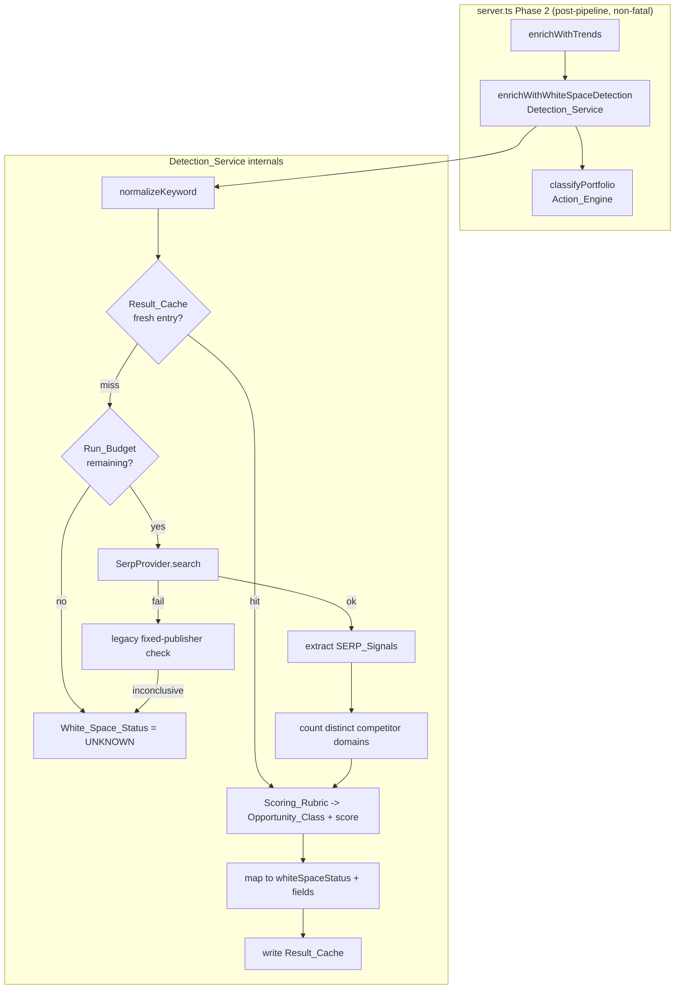

# Design Document

## Overview

This feature replaces `competitorWhitespaceService.ts` — the fixed four-publisher
scraper that currently runs as Phase 2 enrichment step #2 in `server.ts` — with a
**SERP-based Detection_Service**. The new service validates each opportunity's
market keyword against real search-engine results retrieved through a paid SERP
provider, classifies competing syndicated-report coverage from multiple signal
types, and produces a deterministic green/yellow/red opportunity classification.

The design is constrained by one non-negotiable contract: the downstream
`actionClassificationEngine.ts` consumes `whiteSpaceStatus`, `whiteSpaceScore`,
`whiteSpaceCompetitors`, `whiteSpaceLabel`, and `whiteSpaceGapReason` on each
`ReportSuggestion`. Those fields must keep their existing names, types, and
semantics so the Action_Engine continues to work unmodified. The service keeps
the same exported entry point — `enrichWithWhiteSpaceDetection(suggestions:
ReportSuggestion[]): Promise<ReportSuggestion[]>` — so the wiring in `server.ts`
(line 720) does not change.

The replacement addresses three concrete defects in the legacy implementation:

1. **Narrow, broken source list.** Two of four scrapers are effectively dead
   (FBI returns JS-rendered pages with zero parseable titles; AMR returns HTTP
   500), so coverage is judged from two sources. SERP results expose the entire
   first-page competitive field.
2. **Datacenter-IP blocking.** Direct scraping from Render is blocked or
   soft-blocked. A paid SERP provider resolves results server-side and returns
   structured JSON.
3. **Over-reported gaps.** A short, narrow source list plus a single match
   threshold produces false `CONFIRMED_GAP` verdicts. The new service applies
   explicit competitor-count thresholds, report-vs-blog discrimination, and
   multi-signal evidence to reduce false positives.

### Research notes informing the design

- **SERP provider landscape.** SerpApi, DataForSEO, and Serper all return
  structured JSON containing `organic_results`, `ads`/`paid` blocks, and (for
  SerpApi/DataForSEO) an `ai_overview`/`answer_box` block with cited source
  links. The design treats the provider as a single fallible dependency behind a
  `SerpProvider` interface and normalizes its payload into an internal
  `SerpResponse` shape so the rest of the pipeline is provider-agnostic. This
  matches the existing codebase pattern where `edgarService` and `trendsService`
  each wrap one external dependency behind a single function.
- **schema.org markup.** Syndicated-report pages frequently embed JSON-LD with
  `"@type": "Report"` or `"@type": "Product"`. SerpApi surfaces a `rich_snippet`
  / structured-data block per organic result; where the provider does not, the
  presence of report markers in the result's displayed metadata is used as a
  weaker proxy. The design records whether structured markup was observed but
  never depends on it as the sole signal.
- **Existing keyword cleaning.** Both `trendsService.cleanKeyword` and the legacy
  `competitorWhitespaceService.cleanKeyword` strip a leading `global` and
  trailing `market`/`industry`/`sector`/`solutions`. The new normalizer
  generalizes this into the single normalization rule required by Requirement 5
  and reuses the same stopword-based tokenizer for title matching.
- **Persistence.** The codebase persists server-side state as JSON files under
  `/tmp` (`/tmp/kaiso-memory.json`, `/tmp/edgar-cache.json`, env-overridable).
  The Result_Cache follows the same pattern with `SERP_CACHE_PATH` defaulting to
  `/tmp/serp-cache.json`.

## Architecture

The Detection_Service runs as **Phase 2 enrichment step #2**, unchanged in
position. It sits between `enrichWithTrends` and `classifyPortfolio`.



### Module layout

A single new server-side module replaces the legacy file:

- `src/services/serpOpportunityDetectionService.ts` — exports
  `enrichWithWhiteSpaceDetection` (same signature as the legacy export) plus the
  pure helper functions that carry the testable logic.

The legacy `competitorWhitespaceService.ts` is retained but demoted to a
fallback dependency: its publisher-scrape path is invoked only when the SERP
provider is unavailable for the run (Requirement 1.6). Its `enrichWith...`
export is no longer wired into `server.ts`; instead the new module imports its
internal publisher-check helper. To enable that, the legacy file's
`checkPublisher` / `deriveWhiteSpaceResult` helpers are exported (a surgical,
additive change — no behavior change to the legacy logic).

The only edit to `server.ts` is the import source on line 17, repointed from
`competitorWhitespaceService` to `serpOpportunityDetectionService`. The call site
on line 720 is unchanged.

### Layering: pure core vs. I/O shell

The design separates a **pure functional core** (deterministic, no I/O — fully
property-testable) from a thin **I/O shell** (provider calls, caching, delays,
logging). This is the key decision that makes the scoring logic verifiable.

| Layer | Responsibility | Testability |
|---|---|---|
| Pure core | normalize keyword, classify a single result as Competitor_Report, extract signals from a `SerpResponse`, count distinct domains, apply Scoring_Rubric, map to `whiteSpaceStatus` | Property-based |
| I/O shell | `SerpProvider.search`, Result_Cache read/write, Run_Budget accounting, inter-call delay, error catching | Mock-based unit + integration |

## Components and Interfaces

### SerpProvider (external dependency abstraction)

```typescript
/** Provider-agnostic SERP client. One implementation per vendor. */
export interface SerpProvider {
  /** True when a usable API credential is configured for this run. */
  isConfigured(): boolean;
  /** Fetch a SERP_Response for one keyword. Throws/ rejects on failure. */
  search(keyword: string): Promise<SerpResponse>;
}
```

A single concrete implementation (`SerpApiProvider`) is provided initially,
reading its key from `SERP_API_KEY`. `isConfigured()` returns false when the
credential is absent, which drives Requirement 7.2 (skip lookups, all `UNKNOWN`).

### Detection_Service entry point

```typescript
export async function enrichWithWhiteSpaceDetection(
  suggestions: ReportSuggestion[],
  deps?: DetectionDeps,   // injectable for tests; defaults to real provider+cache
): Promise<ReportSuggestion[]>;

interface DetectionDeps {
  provider: SerpProvider;
  cache: ResultCache;
  config: ScoringRubric & RunControlConfig;
  now: () => number;       // injectable clock for deterministic cache-age tests
}
```

The optional `deps` parameter is the seam for property/unit tests: real
`server.ts` calls it with no second argument and gets production wiring.

### Pure core functions

```typescript
/** R5.1–5.3: normalize a raw keyword to the canonical Search_Keyword. */
export function normalizeKeyword(raw: string): string;

/** R5.2/5.3: token-set comparison that is order- and plural-insensitive. */
export function titleMatchesKeyword(title: string, keyword: string): boolean;

/** R3 + R4: classify a single organic result. */
export function classifyResult(
  result: SerpOrganicResult,
  keyword: string,
  config: ScoringRubric,
): ResultClassification;

/** R3: pull every SERP_Signal type out of a full response. */
export function extractSignals(
  response: SerpResponse,
  keyword: string,
  config: ScoringRubric,
): SignalExtraction;

/** R2 + R4.3/4.5: distinct competitor domain count from extracted signals. */
export function countCompetitors(
  extraction: SignalExtraction,
  config: ScoringRubric,
): { count: number; domains: string[] };

/** R2 + R6: deterministic Competitor_Count -> Opportunity_Class + score. */
export function applyRubric(
  competitorCount: number,
  signals: SerpSignalType[],
  config: ScoringRubric,
): Classification;

/** R10: Opportunity_Class -> whiteSpaceStatus and the contract fields. */
export function toWhiteSpaceFields(
  classification: Classification,
  domains: string[],
  signals: SerpSignalType[],
): WhiteSpaceFields;
```

### Result_Cache

```typescript
export interface ResultCache {
  get(key: string, now: number, refreshWindowMs: number): CachedClassification | null;
  set(key: string, value: CachedClassification, now: number): void;
  flush(): Promise<void>;   // persist to disk (R8.5)
}
```

A `FileResultCache` implementation loads `/tmp/serp-cache.json` once per run,
serves entries keyed by normalized Search_Keyword, and flushes once at the end of
the run. `get` returns `null` for missing or stale (age > Refresh_Window) entries
(R8.1, R8.4).

## Data Models

### New optional fields on `ReportSuggestion` (additive — R10.9)

The existing white-space fields are unchanged. New richer fields are added as
optional, so no existing consumer breaks:

```typescript
// src/types.ts — appended to ReportSuggestion, all optional
opportunityClass?: 'GREEN' | 'YELLOW' | 'RED';   // raw band before status mapping
whiteSpaceSignals?: SerpSignalType[];            // R3.8 contributing signal types
whiteSpaceSerpCached?: boolean;                  // served from Result_Cache?
```

The legacy fields keep their meaning: `whiteSpaceStatus`, `whiteSpaceScore`
(0–100), `whiteSpaceLabel`, `whiteSpaceCompetitors` (distinct domains — R10.8),
`whiteSpaceGapReason`.

### Internal types

```typescript
export type SerpSignalType =
  | 'ORGANIC' | 'PAID_AD' | 'AI_OVERVIEW' | 'SCHEMA_MARKUP'
  | 'REPORT_MARKETPLACE' | 'PDF' | 'TITLE_PATTERN';

export type OpportunityClass = 'GREEN' | 'YELLOW' | 'RED';

export interface SerpOrganicResult {
  title: string;
  link: string;            // full URL
  domain: string;          // host extracted from link
  snippet?: string;
  hasReportSchema?: boolean;   // schema.org Report/Product observed (R3.4)
  isPaywalled?: boolean;       // R4.4
}

export interface SerpResponse {
  keyword: string;
  organic: SerpOrganicResult[];
  ads: SerpOrganicResult[];            // R3.2 paid block
  aiOverviewSources: string[];         // cited domains from AI Overview (R3.3)
}

export interface ResultClassification {
  domain: string;
  isCompetitorReport: boolean;
  matchedSignals: SerpSignalType[];
  excludedReason?: 'blog' | 'no_indicator' | 'own_domain';
}

export interface SignalExtraction {
  perResult: ResultClassification[];
  aiOverviewDomains: string[];
  signalTypesPresent: SerpSignalType[];
}

export interface Classification {
  opportunityClass: OpportunityClass;
  score: number;                 // White_Space_Score 0–100
  reason: 'gap' | 'partial' | 'crowded' | 'commoditised' | 'unknown';
}

export interface CachedClassification {
  keyword: string;
  classification: Classification;
  domains: string[];
  signals: SerpSignalType[];
  timestamp: number;
}
```

### Scoring_Rubric (R2.6, R6, R11.3 — single configurable source of truth)

All thresholds and bands live in one `as const` object. No inline literals
elsewhere.

```typescript
export const SCORING_RUBRIC = {
  thresholds: {
    greenMax: 0,        // competitorCount === 0  -> GREEN
    yellowMax: 2,       // 1..2                    -> YELLOW
    crowdedMax: 6,      // 3..6                    -> RED "crowded"
    // >= 7                                        -> RED "commoditised"
  },
  scoreBands: {
    greenBase: 85,      // GREEN >= 75 (R6.1)
    yellowBase: 55,     // YELLOW 40..74 (R6.2)
    redBase: 25,        // RED < 40 (R6.3)
  },
  reportIndicators: {
    titlePatterns: [/market\s+size/i, /market\s+share/i, /market\s+forecast/i],
    reportUrlPaths: [/\/(industry-)?report/i, /\/market-report/i, /-market\b/i],
    pdfMarkers: [/\.pdf($|\?)/i],
  },
  blogPatterns: [/\/blog\//i, /\/news\//i, /\/article(s)?\//i, /\/press-release/i],
  reportMarketplaces: ['researchandmarkets.com', 'reportlinker.com', 'marketresearch.com'],
  ownDomains: ['kaiso'],   // R4.5 — Kaiso's own domains excluded
} as const;

export const RUN_CONTROL = {
  runBudget: Number(process.env.SERP_RUN_BUDGET ?? 12),   // R9.1 (>= 1)
  interCallDelayMs: Number(process.env.SERP_DELAY_MS ?? 1200),  // R9.3
  refreshWindowMs: Number(process.env.SERP_REFRESH_MS ?? 7 * 24 * 60 * 60 * 1000), // R8.4 (7d)
  cachePath: process.env.SERP_CACHE_PATH ?? '/tmp/serp-cache.json',  // R8.5
} as const;
```

### Score within a band

To satisfy R6 strictly while keeping determinism (R6.4), the score is a pure
function of `competitorCount` and the band, with no randomness:

- GREEN: `greenBase` (85) → always ≥ 75.
- YELLOW: `yellowBase` (55) → always in 40–74.
- RED: `max(0, redBase − (competitorCount − crowdedMax) × 3)` clamped to
  `< 40` → 25 for crowded, decaying for commoditised.

### Status mapping (R10.2–10.6)

| Opportunity_Class | whiteSpaceStatus |
|---|---|
| GREEN | `CONFIRMED_GAP` |
| YELLOW | `PARTIAL_COVERAGE` |
| RED | `COMMODITISED` |
| missing/unrecognized | `UNKNOWN` |

## Correctness Properties

*A property is a characteristic or behavior that should hold true across all
valid executions of a system — essentially, a formal statement about what the
system should do. Properties serve as the bridge between human-readable
specifications and machine-verifiable correctness guarantees.*

The pure functional core described in Architecture is the property surface. Each
property below was derived from the acceptance-criteria prework, after a
reflection pass that merged redundant criteria (the threshold partition and the
score bands are one rubric; the report indicators and exclusion rules are one
biconditional; distinct-domain counting subsumes count recording).

### Property 1: Threshold partition determines class and score band

*For any* non-negative Competitor_Count, `applyRubric` assigns the Opportunity_Class
dictated by the Scoring_Rubric partition — 0 → GREEN, 1–2 → YELLOW, 3–6 → RED
"crowded", ≥7 → RED "commoditised" — and the resulting White_Space_Score falls in
the band implied by that class: GREEN ≥ 75, YELLOW in 40–74 inclusive, RED < 40.

**Validates: Requirements 2.1, 2.2, 2.3, 2.4, 6.1, 6.2, 6.3**

### Property 2: Scoring is deterministic

*For any* `SerpResponse`, classifying it more than once produces an identical
Classification (same Opportunity_Class and same White_Space_Score) every time.

**Validates: Requirements 6.4**

### Property 3: Keyword normalization is canonical and idempotent

*For any* raw string, `normalizeKeyword` produces output that is lowercased,
trimmed, has internal whitespace runs collapsed to single spaces, and has any
leading "global" and trailing "market"/"industry" qualifiers removed; and
applying it twice yields the same result (`normalizeKeyword(normalizeKeyword(x))
=== normalizeKeyword(x)`).

**Validates: Requirements 5.1**

### Property 4: Title matching ignores token order and singular/plural form

*For any* Search_Keyword and any title that matches it, shuffling the title's
token order and/or pluralizing or singularizing its tokens does not change the
match result.

**Validates: Requirements 5.2, 5.3**

### Property 5: Search keyword derivation source-of-truth

*For any* Report_Suggestion, the derived Search_Keyword originates from
`marketKeyword` when its normalization is non-empty, and otherwise from
`reportTitle`.

**Validates: Requirements 1.1**

### Property 6: Publisher domain extraction

*For any* organic result whose `link` is a valid URL, the extracted publisher
domain equals the host component of that URL (port, path, query, and scheme
removed).

**Validates: Requirements 1.4**

### Property 7: Empty keyword yields UNKNOWN without a provider call

*For any* Report_Suggestion whose derived Search_Keyword is empty after
normalization (including suggestions missing both `marketKeyword` and
`reportTitle`), the service returns it with `whiteSpaceStatus = UNKNOWN` and does
not invoke the SERP_Provider for it.

**Validates: Requirements 1.5**

### Property 8: Competitor_Report classification is exactly the indicator biconditional

*For any* organic result, `classifyResult` marks it a Competitor_Report **if and
only if** it exhibits at least one report indicator (report-style URL path,
"Market Size/Share/Forecast" title pattern, schema.org Report/Product markup, or
Report_Marketplace domain) AND its domain is not one of Kaiso's own domains AND it
does not match a blog/news/article URL pattern. A result matching a
blog/news/article pattern is excluded unconditionally — that exclusion overrides
any report indicators it exhibits. A paywalled result that still carries a title
pattern or schema markup is counted, provided it is not a blog/news/article URL.

**Validates: Requirements 3.4, 3.5, 3.7, 4.1, 4.2, 4.4, 4.5**

### Property 9: Coverage is detected across organic, paid, and AI-Overview sources

*For any* `SerpResponse`, a competitor domain that qualifies as a Competitor_Report
contributes to the detected coverage regardless of whether it appears in organic
results, paid advertisements, or the AI Overview cited sources.

**Validates: Requirements 3.1, 3.2, 3.3**

### Property 10: Competitor_Count is the distinct-domain count

*For any* set of extracted results, the Competitor_Count equals the number of
distinct publisher domains that classify as Competitor_Reports (a domain
appearing in multiple results is counted once), and `whiteSpaceCompetitors` lists
exactly those distinct domains with no duplicates.

**Validates: Requirements 2.5, 4.3, 10.8**

### Property 11: Contributing signal types are recorded

*For any* classified Report_Suggestion, `whiteSpaceSignals` equals the set of
SERP_Signal types that contributed to the counted Competitor_Reports.

**Validates: Requirements 3.8**

### Property 12: Explanation names the count and contributing signals

*For any* classification, the generated `whiteSpaceGapReason` is a one-sentence
string that contains the numeric Competitor_Count and names each contributing
SERP_Signal type.

**Validates: Requirements 6.5**

### Property 13: Class-to-status mapping is total and single-valued

*For any* Opportunity_Class, `toWhiteSpaceFields` maps it to exactly one
`whiteSpaceStatus` (GREEN → CONFIRMED_GAP, YELLOW → PARTIAL_COVERAGE, RED →
COMMODITISED), and a missing or unrecognized class maps to UNKNOWN; the resulting
`whiteSpaceStatus` is always one of the four contract values.

**Validates: Requirements 10.1, 10.2, 10.3, 10.4, 10.5, 10.6**

### Property 14: Classified suggestions carry the full output contract

*For any* Report_Suggestion that is classified (not skipped or errored), the
output defines `whiteSpaceStatus`, `whiteSpaceScore`, `whiteSpaceLabel`,
`whiteSpaceCompetitors`, and `whiteSpaceGapReason`. The service populates every
one of these fields that it can derive on a best-effort basis; where one or more
fields cannot be derived it still populates the remainder and completes the
classification rather than rejecting or aborting it because a single field is
missing.

**Validates: Requirements 10.7**

### Property 15: Output length is preserved and the service never throws

*For any* input array of Report_Suggestions — including runs where some or all
provider calls fail — the service resolves (never rejects) and returns an array
of the same length as the input.

**Validates: Requirements 7.3, 7.4**

### Property 16: Provider failure isolates to UNKNOWN and processing continues

*For any* run where the SERP_Provider fails for a subset of keywords, the affected
suggestions are returned with `whiteSpaceStatus = UNKNOWN` while the remaining
suggestions are still classified.

**Validates: Requirements 7.1**

### Property 17: Absent credential skips all lookups

*For any* input array, when the SERP_Provider reports it is not configured, every
returned suggestion has `whiteSpaceStatus = UNKNOWN` and no provider call is made.

**Validates: Requirements 7.2**

### Property 18: Each distinct keyword is queried at most once per run

*For any* run, the SERP_Provider is invoked at most once per distinct non-empty
normalized Search_Keyword; suggestions that normalize to a keyword already
attempted (whether it succeeded or failed) reuse that result rather than issuing a
new call.

**Validates: Requirements 5.4, 5.5**

### Property 19: Fresh cache hits avoid billable calls

*For any* Search_Keyword with a non-stale Result_Cache entry, the service uses the
cached classification, does not call the SERP_Provider, and does not consume
Run_Budget; an entry whose age exceeds the Refresh_Window is treated as a miss and
triggers a re-fetch.

**Validates: Requirements 8.1, 8.2, 8.4, 9.4**

### Property 20: Successful classifications are cached with a timestamp

*For any* keyword that is fetched and classified successfully, a Result_Cache
entry holding that classification and the current timestamp is written, such that
a subsequent lookup within the Refresh_Window returns the stored classification.

**Validates: Requirements 8.3**

### Property 21: Billable calls never exceed the Run_Budget

*For any* input array and any Run_Budget B ≥ 1, the number of billable
SERP_Provider calls in a run is at most B, and once the budget is reached every
remaining unprocessed suggestion is returned with `whiteSpaceStatus = UNKNOWN`.

**Validates: Requirements 9.2**

## Scoring Rubric Artifact (Requirement 11)

### Scoring_Rubric table (R11.1)

| Competitor_Count | Opportunity_Class | Reason | White_Space_Score | whiteSpaceStatus |
|---|---|---|---|---|
| 0 | 🟢 GREEN | gap | 85 (≥ 75) | CONFIRMED_GAP |
| 1–2 | 🟡 YELLOW | partial | 55 (40–74) | PARTIAL_COVERAGE |
| 3–6 | 🔴 RED | crowded | 25 (< 40) | COMMODITISED |
| ≥ 7 | 🔴 RED | commoditised | max(0, 25 − (count − 6)×3) (< 40) | COMMODITISED |
| n/a (skip/error/no credential/budget exhausted) | — | unknown | unchanged | UNKNOWN |

Signal strength modifiers (applied within a band, never crossing band
boundaries): schema.org Report/Product markup and Report_Marketplace presence
raise confidence in a RED classification but do not move a GREEN to RED.

### Operator checklist (R11.2)

When manually reviewing a classification, verify each SERP_Signal type:

1. **Organic results** — count distinct publisher domains with genuine report pages.
2. **Paid ads** — note publisher or marketplace ads (ResearchAndMarkets, ReportLinker).
3. **AI Overview** — list domains cited in the AI-generated answer.
4. **schema.org markup** — confirm Report/Product structured data on top results.
5. **Report marketplaces** — flag aggregator listings.
6. **PDF results** — flag `.pdf` report links.
7. **Title patterns** — flag "Market Size/Share/Forecast" titles.
8. **Report-vs-blog** — exclude blog/news/article URLs regardless of any report indicators they exhibit.
9. **Own-domain** — exclude any Kaiso domain.
10. **De-duplicate** — collapse multiple hits from one domain to a single count.

### Named configuration (R11.3)

All threshold boundaries and score bands are expressed as named fields in
`SCORING_RUBRIC` and `RUN_CONTROL` (see Data Models). No inline numeric literals
appear in the classification path.

## Error Handling

The Detection_Service is a **non-fatal Phase 2 enrichment step**, matching the
existing `enrichWithTrends` / legacy whitespace contract. Error handling is
layered so no failure mode can throw into the pipeline (R7.3):

| Failure | Handling | Resulting status |
|---|---|---|
| Derived keyword empty (R1.5) | Skip provider, short-circuit | UNKNOWN |
| Provider not configured (R7.2) | `provider.isConfigured()` false → skip all lookups | UNKNOWN (all) |
| Single provider call rejects/times out (R7.1) | Caught per-keyword; cache the failure marker so duplicates don't retry (R5.5) | UNKNOWN (that keyword) |
| Provider unavailable for the whole run (R1.6) | Fall back to legacy fixed-publisher check; if inconclusive | best-effort, else UNKNOWN |
| Run_Budget reached (R9.2) | Stop issuing calls | UNKNOWN (remaining) |
| Unexpected internal error (R7.3) | Outer `try/catch` per suggestion + top-level guard returns input unchanged | input preserved |
| Cache read/parse error (R8) | Treat as empty cache; log and continue | normal flow |

Every catch logs with the existing `[WhiteSpace]`-style prefix (kept for log
continuity) and the billable call count is logged once per run (R9.5). The
service is wrapped in the same `try/catch` already present at `server.ts:719–725`,
which itself guarantees the pipeline survives even a thrown error — but the
service is designed never to throw.

A dedicated `SerpProviderError extends Error` carries `{ code, keyword }` so the
I/O shell can distinguish credential errors (skip-all) from transient
per-keyword failures (mark one UNKNOWN).

## Testing Strategy

### Dual approach

- **Property-based tests** verify the 21 universal properties above against the
  pure core (`normalizeKeyword`, `titleMatchesKeyword`, `classifyResult`,
  `extractSignals`, `countCompetitors`, `applyRubric`, `toWhiteSpaceFields`) and
  the orchestration invariants (length preservation, call economy, budget cap,
  cache behavior) using an injected mock `SerpProvider` and an in-memory
  `ResultCache` with an injectable clock.
- **Example-based unit tests** cover the orchestration wiring that does not vary
  with input: provider is called with the normalized keyword (R1.2, R1.3), the
  inter-call delay is applied (R9.3, fake timers), the billable count is logged
  (R9.5), and the legacy fallback is invoked when the provider is unavailable
  (R1.6).
- **Edge-case unit tests** cover PDF detection (R3.6), paywalled+indicator
  results (R4.4), and unrecognized Opportunity_Class → UNKNOWN (R10.6); these are
  also exercised by the property generators.
- **Integration test** (1 example) verifies `FileResultCache.flush` writes JSON
  to `SERP_CACHE_PATH` and reloads it (R8.5).
- **Type-level / smoke tests** confirm the legacy white-space fields still exist
  with their original types on `ReportSuggestion` (R10.9) and that thresholds are
  read from `SCORING_RUBRIC` (R2.6, R9.1, R11.3).

### Tooling and configuration

- Property-based testing library: **fast-check** (the standard choice for the
  TypeScript/Vitest ecosystem). The project test runner is Vitest (Vite-based);
  fast-check integrates directly via `test.prop` / `fc.assert`.
- Property tests MUST NOT be hand-rolled; use fast-check generators.
- Each property test runs a **minimum of 100 iterations** (`fc.assert(..., {
  numRuns: 100 })`).
- Each property test is tagged with a comment referencing its design property:
  **Feature: serp-opportunity-detection, Property {number}: {property_text}**.
- Each correctness property is implemented by a **single** property-based test.

### Generators

- `arbReportSuggestion` — `ReportSuggestion` with controllable `marketKeyword` /
  `reportTitle` (including empty/whitespace and missing-both cases for P7).
- `arbOrganicResult` — URLs spanning report paths, blog/news paths, marketplace
  domains, PDFs, paywalled flags, schema flags, and own-domains (drives P6, P8).
- `arbSerpResponse` — places competitor domains across organic/ads/AI-overview
  blocks (drives P9), with duplicate domains for P10.
- `arbCompetitorCount` — non-negative integers spanning all four bands incl.
  boundaries 0/1/2/3/6/7 (drives P1).
- `MockSerpProvider` — configurable per-keyword success/failure/latency and a
  call counter (drives P15–P21).
