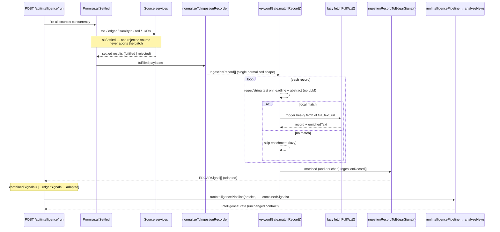

# Design Document: Zero-Cost Ingestion Layer

## Overview

The Zero-Cost Ingestion Layer replaces the rejected 4-cron blueprint with a single, request-triggered, in-process ingestion pipeline that runs inside the existing `POST /api/intelligence/run` handler in `server.ts`. It widens the existing external-signal funnel (RSS + EDGAR + SAM.gov) to add native EU TED and UK FTS / Contracts Finder procurement feeds, a decoupled BLS reference layer, and a local zero-LLM keyword gate — all while preserving the existing pipeline contract (`EDGARSignal` is the seam, `ReportSuggestion` is the currency).

The hard constraint is **$0/month infrastructure cost**. Every source is a free-tier or official public API; there are **no new npm packages** (everything uses native `fetch`, `fs`, `path`, already present in the codebase), and **no background crons** (which would lose `/tmp` state across Render's ephemeral instances). The Gemini runtime stays locked at `gemini-2.5-flash` via `@google/genai`; this design touches nothing in `geminiService.ts`.

The architectural shift is from "many sources racing into a merge" to "many sources normalize into ONE DTO (`IngestionRecord`), pass a local keyword gate, lazily enrich only on a match, then collapse through a single adapter back into the `EDGARSignal` seam." This keeps every downstream stage (`analyzeNews` → scoring → dedup → diversity → …) completely unchanged.

---

## Architecture

```mermaid
graph TD
    subgraph Request["POST /api/intelligence/run (single request-triggered pipeline)"]
        A[Promise.allSettled fan-out] --> R[rssService → RSSArticle&#91;&#93;]
        A --> E[edgarService → EDGARSignal&#91;&#93;]
        A --> S[samGovService.fetchSamNoticeById → SamSignal&#91;&#93;]
        A --> T[tedService → IngestionRecord&#91;&#93;]
        A --> U[ukFtsService → IngestionRecord&#91;&#93;]

        R --> N[Normalizer: all sources → IngestionRecord&#91;&#93;]
        E --> N
        S --> N
        T --> N
        U --> N

        N --> G{Local 42-keyword gate<br/>headline + abstract<br/>ZERO LLM calls}
        G -- no match --> X[dropped / not enriched]
        G -- match --> L[Lazy full_text_url fetch<br/>enrich matched records only]
        L --> AD[ingestionAdapter:<br/>IngestionRecord → EDGARSignal]
        AD --> C[combinedSignals: EDGARSignal&#91;&#93;]
        C --> P[runIntelligencePipeline → analyzeNews Stage 1]
    end

    subgraph Reference["Decoupled — NOT in the per-event race"]
        B[blsReferenceService<br/>daily /tmp disk cache<br/>static PPI/wage table]
    end
    B -. read-only lookup .-> SC[scoringEngine]

    classDef new fill:#1f6f43,stroke:#0d3b24,color:#fff;
    classDef changed fill:#7a5c12,stroke:#3d2e09,color:#fff;
    class T,U,N,G,L,AD,B new;
    class S,A changed;
```



**Legend:** green = new file/node, amber = changed existing file. The reference layer (BLS) is deliberately drawn outside the request box — it is a static table refreshed on its own daily cadence and read synchronously by `scoringEngine`, never part of the ingestion race.

### Cost posture ($0/month)

| Source | Endpoint | Auth | Cost |
|---|---|---|---|
| RSS / NewsAPI | existing | `NEWS_API_KEY` (free tier 100/day) | $0 |
| SEC EDGAR | `efts.sec.gov` | none (User-Agent only) | $0 |
| SAM.gov | `api.sam.gov` | `SAM_GOV_API_KEY` (free, ~10 req/day) | $0 |
| EU TED | `api.ted.europa.eu` | none (public) | $0 |
| UK FTS / Contracts Finder | `www.find-tender.service.gov.uk` / `www.contractsfinder.service.gov.uk` OCDS | none (public) | $0 |
| US BLS | `api.bls.gov/publicAPI/v2` | `DATA_GOV_API_KEY` (free registration key) | $0 |
| EU EPO (OPS v3.2) | `ops.epo.org` | `EPO_CONSUMER_KEY` / `EPO_CONSUMER_SECRET` (OAuth2, free weekly quota) | $0 |

No new dependencies, no compute beyond the existing single Render web service, all caching on the existing `/tmp` disk. **Net infra delta: $0.**

---

## Sequence / Data-Flow



Flow in one line: **`Promise.allSettled` → `IngestionRecord[]` → 42-keyword gate → lazy full-text fetch (matches only) → `IngestionRecord`→`EDGARSignal` adapter → `combinedSignals` → `analyzeNews`.**

---

## Intended File Paths

| Path | Status | Purpose |
|---|---|---|
| `server.ts` | **changed** | `Promise.all` → `Promise.allSettled`; wire TED/UK FTS; route records through normalizer + gate + adapter |
| `src/services/tedService.ts` | **new** | Native `fetch` to EU TED API → `IngestionRecord[]` |
| `src/services/ukFtsService.ts` | **new** | Native `fetch` to UK FTS + Contracts Finder OCDS → `IngestionRecord[]` |
| `src/services/epoService.ts` | **new** | EPO OPS v3.2 (OAuth2 client-credentials) → `IngestionRecord[]` (`content_type: 'epo_patent'`) |
| `src/services/blsReferenceService.ts` | **new** | Daily-refreshed `/tmp` reference table (sector PPI/wage weights) |
| `src/services/samGovService.ts` | **changed** | Strip `VERTICAL_KEYWORDS` loop; add surgical `fetchSamNoticeById()` |
| `src/services/ingestion/ingestionTypes.ts` | **new** | `IngestionRecord` DTO + supporting unions |
| `src/services/ingestion/ingestionAdapter.ts` | **new** | `ingestionRecordToEdgarSignal()` single adapter |
| `src/services/ingestion/keywordGate.ts` | **new** | 42-keyword local string/regex matcher |
| `src/services/scoringEngine.ts` | *(read-only addition only)* | Consumes BLS table via a defined read interface; **no behavior change in this design** |
| `src/types.ts` | **NOT modified** | See "Changes Requiring src/types.ts Approval" — flagged, not applied |

---

## 1. In-Process Orchestration (`server.ts`)

The single request-triggered pipeline is preserved. The only structural change to the fan-out is `Promise.all` → `Promise.allSettled`, so one failed source can never abort ingestion. Rotated env vars are read **by name only**.

```typescript
// server.ts — env vars read by NAME only (values never hardcoded)
const DATA_GOV_API_KEY = process.env.DATA_GOV_API_KEY ?? '';   // BLS / data.gov rotation
const SAM_GOV_API_KEY  = process.env.SAM_GOV_API_KEY ?? '';    // SAM.gov surgical lookup

// BEFORE: Promise.all aborts the whole batch if ANY source rejects.
// AFTER:  Promise.allSettled isolates failures per source.
const settled = await Promise.allSettled([
  ingestStableRssFeeds(),          // index 0 → { articles, … }
  fetchEdgarSignals(),             // index 1 → EDGARSignal[]
  fetchTedNotices(),               // index 2 → IngestionRecord[]
  fetchUkFtsNotices(),             // index 3 → IngestionRecord[]
]);

// Helper: unwrap a settled result or fall back to a typed empty value (non-fatal).
function settledOr<T>(r: PromiseSettledResult<T>, fallback: T, label: string): T {
  if (r.status === 'fulfilled') return r.value;
  console.warn(`[Ingestion] ${label} failed (non-fatal):`, r.reason);
  return fallback;
}

const { articles: rssArticles } = settledOr(settled[0], { articles: [], successCount: 0, failureCount: 0 } as any, 'RSS');
const edgarSignals  = settledOr(settled[1], [] as EDGARSignal[], 'EDGAR');
const tedRecords    = settledOr(settled[2], [] as IngestionRecord[], 'TED');
const ukFtsRecords  = settledOr(settled[3], [] as IngestionRecord[], 'UK-FTS');
```

**Why no crons:** Render's filesystem under `/tmp` is per-instance and ephemeral. A background cron on one instance cannot guarantee the `/tmp` cache it writes is the one a later request reads (cross-instance state loss). Keeping ingestion request-triggered means the cache is always written and read within the same warm instance lifecycle, exactly as `edgarService`/`samGovService` already rely on.

---

## 2. Native Procurement Nodes (`tedService.ts`, `ukFtsService.ts`)

Direct native `fetch()` to official endpoints — **Apify is completely bypassed**. Both services mirror the `edgarService`/`samGovService` resilience pattern: non-fatal fetch, parse-to-record, 24h `/tmp` disk cache.

### EU TED — `src/services/tedService.ts`

```typescript
// Endpoint + query params
const TED_BASE_URL = 'https://api.ted.europa.eu/v3/notices/search';
const TED_CACHE_FILE = process.env.TED_CACHE_PATH ?? path.join('/tmp', 'ted-cache.json');
const TED_CACHE_TTL_MS = 24 * 60 * 60 * 1000; // 24h, mirrors edgarService

// POST body (TED expert search). `query` scopes to recent contract notices.
interface TedSearchBody {
  query: string;        // e.g. 'publication-date>=today(-30) AND notice-type=cn-standard'
  fields: string[];     // ['ND','PD','TI','DS','CY','links']
  limit: number;        // page size (kept low; 24h cache absorbs cost)
  scope: 'ACTIVE';
}

// Raw TED notice (subset we read)
interface TedNotice {
  ND: string;           // notice document number → external_id
  TI: string;           // title → headline
  DS?: string;          // short description → abstract
  PD: string;           // publication date (YYYYMMDD) → tracking_timestamp
  CY?: string;          // country code → jurisdiction
  links?: { html?: { [lang: string]: string } }; // → source_url / full_text_url
}

/** Resilient, non-fatal. Returns [] on any failure. 24h /tmp cache. */
export async function fetchTedNotices(): Promise<IngestionRecord[]>;
```

### UK FTS / Contracts Finder — `src/services/ukFtsService.ts`

Both UK endpoints expose **OCDS** (Open Contracting Data Standard) release packages, so one parser serves both.

```typescript
// Endpoints (OCDS release packages, public, no key)
const UK_FTS_BASE = 'https://www.find-tender.service.gov.uk/api/1.0/ocdsReleasePackages';
const UK_CF_BASE  = 'https://www.contractsfinder.service.gov.uk/Published/Notices/OCDS/Search';
const UKFTS_CACHE_FILE = process.env.UKFTS_CACHE_PATH ?? path.join('/tmp', 'ukfts-cache.json');
const UKFTS_CACHE_TTL_MS = 24 * 60 * 60 * 1000;

// Query params: updatedFrom / updatedTo (ISO), stages=tender, limit
interface OcdsRelease {
  ocid: string;                         // → external_id
  date: string;                         // ISO → tracking_timestamp
  tender?: {
    title?: string;                     // → headline
    description?: string;               // → abstract
    documents?: { url: string }[];      // → full_text_url
  };
  buyer?: { name?: string };
}
interface OcdsReleasePackage { releases: OcdsRelease[]; links?: { next?: string }; }

/** Resilient, non-fatal. Merges FTS + Contracts Finder. 24h /tmp cache. */
export async function fetchUkFtsNotices(): Promise<IngestionRecord[]>;
```

Each service: (1) check 24h `/tmp` cache, (2) on miss `fetch` with a descriptive User-Agent, (3) on non-OK response `console.warn` and return `[]` (never throw), (4) parse to `IngestionRecord[]`, (5) write cache. Identical lifecycle to `edgarService.fetchEdgarSignals()`.

---

## 3. Decoupled BLS Reference Layer (`blsReferenceService.ts`)

A **static reference table**, not an event source. It is refreshed at most once per day onto `/tmp` disk and read synchronously by `scoringEngine`. It is **not** part of the `Promise.allSettled` ingestion race.

```typescript
// src/services/blsReferenceService.ts
const BLS_BASE_URL  = 'https://api.bls.gov/publicAPI/v2/timeseries/data/';
const BLS_CACHE_FILE = process.env.BLS_CACHE_PATH ?? path.join('/tmp', 'bls-reference.json');
const BLS_CACHE_TTL_MS = 24 * 60 * 60 * 1000; // daily refresh
const DATA_GOV_API_KEY = process.env.DATA_GOV_API_KEY ?? ''; // by name only

// One row per Kaiso vertical: producer-price + wage pressure weights.
export interface BlsSectorReference {
  vertical: string;       // Kaiso vertical key
  ppiIndex: number;       // latest Producer Price Index value
  ppiYoyPct: number;      // YoY % change (sector cost pressure)
  wageIndex: number;      // latest sector wage / ECI value
  wageYoyPct: number;     // YoY % wage growth
  refreshedAt: string;    // ISO timestamp of the row
}

// The lookup table shape: vertical → reference row.
export type BlsReferenceTable = Record<string, BlsSectorReference>;

/** Returns the cached daily table, refreshing from BLS only if >24h stale.
 *  Resilient: on failure returns the last good cache or {} (neutral). */
export async function getBlsReferenceTable(): Promise<BlsReferenceTable>;

/** Synchronous read used inside the deterministic scoring path.
 *  Returns undefined when the vertical is absent → scoring stays neutral. */
export function lookupSectorReference(
  table: BlsReferenceTable,
  vertical: string
): BlsSectorReference | undefined;
```

### How `scoringEngine` consumes it (read interface only — no behavior change here)

This design **defines the read seam only**. `scoringEngine.calculateOpportunityScore` keeps its current signature and math; the BLS table is threaded in as an **optional** parameter so the engine can read it later without any change to existing callers.

```typescript
// scoringEngine.ts — read interface ONLY (behavior unchanged in this design)
export function calculateOpportunityScore(
  suggestion: ReportSuggestion,
  calibration?: VerticalCalibration,
  blsReference?: BlsReferenceTable   // NEW optional arg — defaults undefined
): ReportSuggestion {
  // const ref = blsReference ? lookupSectorReference(blsReference, String(suggestion.vertical)) : undefined;
  // (Consumption of `ref` is intentionally OUT OF SCOPE for this design.
  //  Today: if undefined → identical output to current behavior.)
  ...
}
```

Because the new argument is optional and unread, every existing call site (the orchestrator's `calculateOpportunityScore(processed, calibration)`) compiles and behaves identically. The orchestrator would later pass the table down, but that wiring is explicitly **not** part of this design.

---

## 4. Precision SAM.gov Demotion (`samGovService.ts`)

The mass `VERTICAL_KEYWORDS` query loop (which fires ~42 keyword queries per cycle and threatens SAM.gov's ~10 req/day public limit) is removed and replaced with a **surgical single-notice-ID lookup**. The existing `SamSignal` shape and the `EDGARSignal` adapter seam are kept intact.

### Before / After exported surface

```typescript
// ── BEFORE (exported surface) ───────────────────────────────────────────────
export interface SamSignal { /* unchanged */ }
export async function fetchSamGovSignals(keywords?: string[]): Promise<SamSignal[]>;
//   - iterates the full 14-vertical VERTICAL_KEYWORDS map
//   - up to ~42 keyword queries per run → burns the ~10 req/day public limit

// ── AFTER (exported surface) ────────────────────────────────────────────────
export interface SamSignal { /* unchanged — adapter seam preserved */ }

/** Surgical lookup: fetch ONE notice by its SAM.gov noticeId.
 *  Zero keyword-loop spend. Non-fatal: returns null on miss/failure. */
export async function fetchSamNoticeById(noticeId: string): Promise<SamSignal | null>;
```

`VERTICAL_KEYWORDS`, `verticalForKeyword`, the query-list builder, and the per-cycle cap loop are deleted. The 24h `/tmp` cache, `cleanText`, `parseSamOpportunity`, and the `SamSignal` interface are retained (the parser now maps a single notice). `fetchSamNoticeById` calls the by-ID endpoint:

```typescript
// Single-notice endpoint — one request, not 42.
// GET https://api.sam.gov/opportunities/v2/opportunities/{noticeId}?api_key=...
const SAMGOV_NOTICE_URL = (id: string) =>
  `https://api.sam.gov/opportunities/v2/opportunities/${encodeURIComponent(id)}`;
// api_key appended from process.env.SAM_GOV_API_KEY (by name; absent → null, non-fatal)
```

The server-side adapter that maps `SamSignal → EDGARSignal` (currently inline at `adaptedSamSignals`) is unchanged in shape; SAM signals are now sourced surgically (e.g. from a watchlist of known notice IDs) rather than via the keyword sweep.

---

## 5. Unified DTO & Seam Integration (`ingestion/`)

ONE normalization target for every source: `IngestionRecord`. A single adapter maps it to the existing `EDGARSignal`, so it plugs into the current `server.ts` seam with **no pipeline or type changes downstream**.

### DTO — `src/services/ingestion/ingestionTypes.ts`

```typescript
// Local DTO — declared here, NOT in src/types.ts (types.ts left untouched).
export type SourceSystem =
  | 'RSS' | 'NEWSAPI' | 'EDGAR' | 'SAM_GOV' | 'EU_TED' | 'UK_FTS' | 'UK_CONTRACTS_FINDER'
  | 'US_FEDERAL_REGISTER' | 'EU_EPO';

export type ContentType =
  | 'news' | 'regulatory_filing' | 'procurement_notice' | 'award_notice' | 'epo_patent';

export interface IngestionRecord {
  source_system: SourceSystem;   // which connector produced this record
  content_type: ContentType;     // semantic class of the item
  jurisdiction: string;          // ISO country/region code, e.g. 'US' | 'EU' | 'GB'
  headline: string;              // short title — fed to the keyword gate
  abstract: string;              // summary/description — fed to the keyword gate
  source_url: string;            // human-readable canonical link
  full_text_url: string | null;  // heavy document URL — fetched LAZILY on gate match
  tracking_timestamp: string;    // ISO timestamp used for freshness/ordering
  external_id: string;           // stable per-source id (noticeId, ocid, accession, …)
  vertical_hint: string | null;  // best-effort vertical tag (null = let Gemini decide)
  language: string;              // ISO 639-1, e.g. 'en'
}
```

### Single adapter — `src/services/ingestion/ingestionAdapter.ts`

```typescript
import type { EDGARSignal } from '../../types';
import type { IngestionRecord } from './ingestionTypes';

/**
 * The ONE seam function: IngestionRecord → EDGARSignal.
 * Plugs straight into server.ts's existing `combinedSignals` merge so Stage 1
 * (analyzeNews) consumes it with zero downstream changes.
 */
export function ingestionRecordToEdgarSignal(rec: IngestionRecord): EDGARSignal {
  return {
    title: rec.headline,
    filingType: rec.content_type,                 // e.g. 'procurement_notice'
    companyName: rec.source_system,               // issuing system / buyer surrogate
    filingDate: rec.tracking_timestamp,
    excerpt: rec.abstract,
    url: rec.source_url,
    vertical: rec.vertical_hint ?? 'General',
    matchedKeyword: rec.external_id,              // carried through for traceability
  };
}

/** Batch helper for the server seam. */
export function adaptRecords(records: IngestionRecord[]): EDGARSignal[] {
  return records.map(ingestionRecordToEdgarSignal);
}
```

### Seam integration in `server.ts`

```typescript
// combinedSignals stays EDGARSignal[] — downstream contract is identical.
const gatedRecords = await runKeywordGateAndEnrich(allIngestionRecords); // §6
const combinedSignals: EDGARSignal[] = [
  ...edgarSignals,
  ...adaptedSamSignals,            // existing SAM seam (unchanged shape)
  ...adaptRecords(gatedRecords),   // NEW: TED + UK FTS via the single adapter
];
```

A normalizer (`normalizeToIngestionRecords`) converts the fulfilled RSS/EDGAR/SAM payloads into `IngestionRecord[]` alongside the already-record-shaped TED/UK FTS outputs, producing the single `allIngestionRecords` stream that feeds the gate.

---

## 6. Local String-Matching Gate (`keywordGate.ts`)

A native TypeScript 42-keyword regex/string gate runs against `headline + abstract` of each `IngestionRecord`. **Zero LLM calls.** Only on a local match do we trigger the heavy async `full_text_url` fetch (lazy fetching), then hand the enriched records to the existing Gemini Stage 1.

**Exact location in flow:** between normalization (`IngestionRecord[]`) and `analyzeNews` — specifically before the `ingestionRecordToEdgarSignal` adapter, so only gate-passing records are enriched and adapted into `combinedSignals`.

```typescript
// src/services/ingestion/keywordGate.ts

// 42 commercial-signal keywords (Kaiso's 14 verticals × high-intent terms).
const GATE_KEYWORDS: readonly string[] = [
  'semiconductor','chip fabrication','advanced packaging',
  'medical device','clinical trial','drug approval',
  'electric vehicle','battery','autonomous',
  'renewable energy','energy storage','grid',
  'digital payments','embedded finance','open banking',
  'specialty chemicals','advanced materials','coatings',
  'satellite','unmanned','defense procurement',
  'precision agriculture','agritech','crop',
  'cold chain','food safety','alternative protein',
  'modular construction','infrastructure','facility modernization',
  'e-commerce logistics','last mile','supply chain',
  '5g','cloud migration','cybersecurity',
  'insurtech','banking as a service','reshoring',
  'carbon capture','hydrogen','data center',
] as const; // 42 entries

// Precompiled word-boundary regex (case-insensitive). Built once at module load.
const GATE_REGEX: RegExp =
  new RegExp(`\\b(${GATE_KEYWORDS.map(k => k.replace(/[.*+?^${}()|[\\]\\\\]/g, '\\\\$&')).join('|')})\\b`, 'i');

/** Pure, synchronous, zero-LLM. True if headline+abstract hits any keyword. */
export function matchRecord(rec: IngestionRecord): boolean {
  return GATE_REGEX.test(`${rec.headline} ${rec.abstract}`);
}

/** Lazy enrichment: fetch full_text_url ONLY for matched records (non-fatal). */
export async function enrichFullText(rec: IngestionRecord): Promise<IngestionRecord & { fullText?: string }>;

/** Orchestration helper used by server.ts: gate → lazy fetch → return matches. */
export async function runKeywordGateAndEnrich(
  records: IngestionRecord[]
): Promise<IngestionRecord[]>;
```

`matchRecord` is a pure synchronous predicate (no I/O, no LLM). `enrichFullText` is the only async/heavy step and runs **only** for records that already passed the gate, bounding outbound full-text fetches to the high-signal subset.

---

## Components and Interfaces

| Component | File | Exported surface |
|---|---|---|
| TED connector | `tedService.ts` | `fetchTedNotices(): Promise<IngestionRecord[]>` |
| UK FTS / Contracts Finder connector | `ukFtsService.ts` | `fetchUkFtsNotices(): Promise<IngestionRecord[]>` |
| BLS reference layer | `blsReferenceService.ts` | `getBlsReferenceTable()`, `lookupSectorReference()` |
| SAM.gov (demoted) | `samGovService.ts` | `fetchSamNoticeById(noticeId): Promise<SamSignal \| null>` |
| Ingestion DTO | `ingestion/ingestionTypes.ts` | `IngestionRecord`, `SourceSystem`, `ContentType` |
| Seam adapter | `ingestion/ingestionAdapter.ts` | `ingestionRecordToEdgarSignal()`, `adaptRecords()` |
| Keyword gate | `ingestion/keywordGate.ts` | `matchRecord()`, `enrichFullText()`, `runKeywordGateAndEnrich()` |
| Orchestration | `server.ts` | `Promise.allSettled` fan-out + `settledOr()` helper |

Consolidated function signatures:

```typescript
// tedService.ts
export async function fetchTedNotices(): Promise<IngestionRecord[]>;

// ukFtsService.ts
export async function fetchUkFtsNotices(): Promise<IngestionRecord[]>;

// blsReferenceService.ts
export async function getBlsReferenceTable(): Promise<BlsReferenceTable>;
export function lookupSectorReference(table: BlsReferenceTable, vertical: string): BlsSectorReference | undefined;

// samGovService.ts (demoted)
export async function fetchSamNoticeById(noticeId: string): Promise<SamSignal | null>;

// ingestion/ingestionAdapter.ts
export function ingestionRecordToEdgarSignal(rec: IngestionRecord): EDGARSignal;
export function adaptRecords(records: IngestionRecord[]): EDGARSignal[];

// ingestion/keywordGate.ts
export function matchRecord(rec: IngestionRecord): boolean;
export async function enrichFullText(rec: IngestionRecord): Promise<IngestionRecord & { fullText?: string }>;
export async function runKeywordGateAndEnrich(records: IngestionRecord[]): Promise<IngestionRecord[]>;
```

---

## Data Models

The single normalization target and the existing seam type it collapses into.

### Model 1: `IngestionRecord` (the one DTO)

```typescript
export interface IngestionRecord {
  source_system: SourceSystem;   // 'RSS'|'NEWSAPI'|'EDGAR'|'SAM_GOV'|'EU_TED'|'UK_FTS'|'UK_CONTRACTS_FINDER'
  content_type: ContentType;     // 'news'|'regulatory_filing'|'procurement_notice'|'award_notice'
  jurisdiction: string;          // ISO region, e.g. 'US' | 'EU' | 'GB'
  headline: string;              // gate input
  abstract: string;              // gate input
  source_url: string;            // canonical link
  full_text_url: string | null;  // heavy doc — fetched lazily on gate match
  tracking_timestamp: string;    // ISO timestamp
  external_id: string;           // stable per-source id
  vertical_hint: string | null;  // best-effort vertical (null = let Gemini decide)
  language: string;              // ISO 639-1
}
```

**Validation rules:** `headline` non-empty; `tracking_timestamp` parseable ISO; `full_text_url` either a valid URL or `null`; `language` defaults to `'en'` when the source omits it.

### Model 2: `BlsSectorReference` / `BlsReferenceTable` (static reference)

```typescript
export interface BlsSectorReference {
  vertical: string; ppiIndex: number; ppiYoyPct: number;
  wageIndex: number; wageYoyPct: number; refreshedAt: string; // ISO
}
export type BlsReferenceTable = Record<string, BlsSectorReference>;
```

**Validation rules:** one row per Kaiso vertical key; numeric fields finite; `refreshedAt` drives the 24h staleness check.

### Model 3: `EDGARSignal` (existing seam — unchanged)

The adapter target. Defined in `src/types.ts` and **not modified**. `IngestionRecord` maps onto it via `ingestionRecordToEdgarSignal`, preserving the downstream contract consumed by `analyzeNews`.

## Correctness Properties

### Property 1: Failure isolation
For any subset of sources that reject, ingestion still returns the union of the fulfilled sources' records (no abort): `∀ source s that rejects, result ⊇ records(all fulfilled sources)`.

### Property 2: Seam invariance
`combinedSignals` is always `EDGARSignal[]`; no downstream stage observes any new field, and the `analyzeNews` input type is unchanged.

### Property 3: Gate soundness
`enrichFullText` is invoked for a record `r` **iff** `matchRecord(r) === true`. No unmatched record triggers a heavy fetch.

### Property 4: Zero-LLM gating
`matchRecord` performs no network or model call — it is a pure function of `headline + abstract`.

### Property 5: BLS neutrality
When `blsReference` is `undefined` or a vertical is absent, `calculateOpportunityScore` produces output identical to current behavior.

### Property 6: Cost invariance
No code path introduces a paid API, a new npm dependency, or a background cron. SAM.gov outbound requests per cycle drop from ~42 to ≤ N (N = explicit watchlist IDs), protecting the ~10 req/day limit.

### Property 7: Cache durability
Each new source reads/writes only `/tmp/*.json` with a 24h TTL within the same warm instance, matching the existing EDGAR/SAM lifecycle.

---

## Error Handling

| Scenario | Condition | Response | Recovery |
|---|---|---|---|
| Source endpoint down | non-OK / network error in a connector | `console.warn`, return `[]` | `allSettled` keeps other sources; pipeline proceeds |
| Missing env key | `SAM_GOV_API_KEY` / `DATA_GOV_API_KEY` absent | log once, skip that source | neutral/empty contribution, no throw |
| Full-text fetch fails | `enrichFullText` non-OK | record kept un-enriched (headline+abstract only) | adapter still emits a valid `EDGARSignal` |
| Malformed payload | parse error per item | skip that item (return null), continue | partial batch still valid |
| Cache unreadable/unwritable | `/tmp` I/O error | warn, treat as cache miss | fresh fetch; never throws |

All connectors are **non-fatal by construction**, mirroring `edgarService`/`samGovService`.

---

## Testing Strategy

- **Unit:** `matchRecord` (boundary keywords, case-insensitivity, no-match), `ingestionRecordToEdgarSignal` (field mapping, `vertical_hint` null → `'General'`), `lookupSectorReference` (present/absent vertical), `settledOr` unwrap logic.
- **Property-based (fast-check, already in the repo):** for arbitrary `IngestionRecord[]`, (a) every output of `adaptRecords` is a structurally valid `EDGARSignal`; (b) `runKeywordGateAndEnrich` output ⊆ input and every returned record satisfies `matchRecord`; (c) failure-isolation: for arbitrary settled mixes, result equals union of fulfilled records.
- **Integration:** mock TED/UK FTS HTTP responses → assert `IngestionRecord[]` shape and 24h cache hit on second call; assert `combinedSignals` remains `EDGARSignal[]` end-to-end.
- **No new test deps** — uses the existing `vitest` + `fast-check` setup.

---

## Performance Considerations

- TED/UK FTS each protected by a 24h `/tmp` cache → near-zero cost on warm cache hits (same profile as EDGAR's ~0ms hit).
- The keyword gate is a single precompiled regex evaluated once per record (O(n) over records, no I/O) — it *reduces* downstream load by limiting heavy full-text fetches to matches only.
- `Promise.allSettled` runs all sources concurrently, so total ingestion latency ≈ slowest single source, not the sum.

---

## Security Considerations

- **All API keys read from environment variables by NAME only** (`process.env.DATA_GOV_API_KEY`, `process.env.SAM_GOV_API_KEY`); no key values appear anywhere in source or this design.
- Treat all fetched procurement/filing content as **untrusted**: `cleanText`-style HTML stripping and length caps before any text reaches Gemini.
- No new outbound destinations beyond the official government/EU/SEC endpoints listed; no third-party data egress.

---

## Dependencies

**No new npm packages.** Uses only what is already present: native `fetch` (Node ≥18 on Render), `fs`, `path`, existing `vitest` + `fast-check` for tests. Gemini stays on `gemini-2.5-flash` via `@google/genai` — untouched.

---

## Changes Requiring `src/types.ts` Approval (FLAGGED)

This design is engineered to require **zero** changes to `src/types.ts`. The mechanisms that keep it untouched:

- `IngestionRecord`, `SourceSystem`, `ContentType` live in `src/services/ingestion/ingestionTypes.ts` (local module type, like the existing `SamSignal` in `samGovService.ts`).
- `BlsSectorReference` / `BlsReferenceTable` live in `blsReferenceService.ts`.
- The adapter collapses everything back into the **existing** `EDGARSignal` interface, so the pipeline currency (`ReportSuggestion`) and the seam (`EDGARSignal`) are unchanged.

**The only future change that WOULD touch `src/types.ts` — and therefore requires your explicit approval before any implementation:**

> If you later want `IngestionRecord` provenance fields (e.g. `source_system`, `jurisdiction`, `external_id`, `language`) to survive **into** `ReportSuggestion` so they are visible in the UI / exports, that requires adding optional fields to `EDGARSignal` and/or `ReportSuggestion` in `src/types.ts`. **This is NOT included in this design.** It is flagged here as a separate, approval-gated change.

Until you approve such a change, all provenance beyond what `EDGARSignal` already carries is intentionally dropped at the adapter boundary, preserving the locked type contract.
